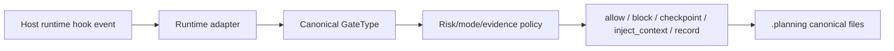
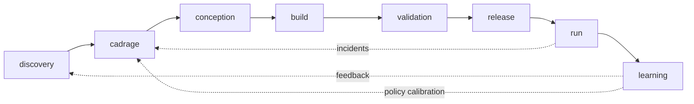
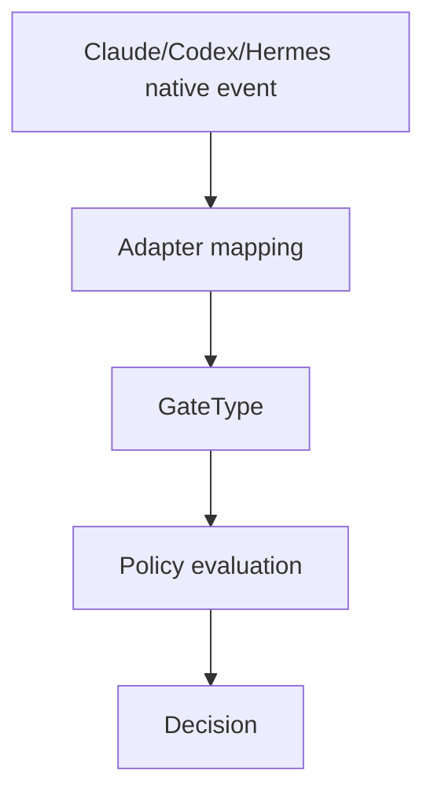

# PFV4 Canonical Runtime Contract

Status: accepted baseline for the next harmonization pass

Date: 2026-05-03

This document is the executable vocabulary contract for Pipeline Fractale v4.
When another PFV4 document conflicts with this contract, this document wins until
an explicit architecture decision replaces it.

## 1. Purpose

PFV4 has three layers that must not be confused:

1. **Pipeline model**: the macro cycles and fractal subphases.
2. **Runtime contract**: risk, mode, gates, evidence, and state.
3. **Runtime adapters**: Claude Code, Codex, Hermes, or another host runtime.

The harness owns the runtime contract. Host runtimes only provide hook events
that are adapted into canonical PFV4 gates.



## 2. Macro Cycles

The complete PFV4 pipeline has eight macro cycles.

```ts
export type MacroCycle =
  | "discovery"
  | "cadrage"
  | "conception"
  | "build"
  | "validation"
  | "release"
  | "run"
  | "learning";
```

`cadrage` remains the accepted domain term for product/solution framing. The
French filename `08-apprentissage` may remain for historical continuity, but the
canonical machine value is `learning`.



## 3. Fractal Subphases

Every macro cycle is traversed through the same seven subphases.

```ts
export type SubPhase =
  | "Observer"
  | "Define"
  | "Design"
  | "Execute"
  | "Verify"
  | "Capitalize"
  | "Transmit";
```

Machine state must keep macro cycle and subphase separate.

```ts
// Correct
phase: "build";
sub_phase: "Verify";

// Incorrect
phase: "Build.Verify";
```

## 4. Risk Classes

PFV4 uses five risk classes.

```ts
export type RiskClass = "T" | "L" | "M" | "H" | "C";

export const riskRank: Record<RiskClass, number> = {
  T: 0,
  L: 1,
  M: 2,
  H: 3,
  C: 4,
};
```

Never compare risk classes lexicographically.

```ts
// Correct
riskRank[current] >= riskRank.M;

// Incorrect
current >= "M";
```

Mapping:

| Class | Meaning | Default mode | Bypass |
|---|---|---|---|
| `T` | Trivial | `auto` | allowed |
| `L` | Low | `auto` | conditional |
| `M` | Medium | `auto` | blocked by default |
| `H` | High | `auto` with human checkpoint | forbidden |
| `C` | Critical | `pairing` or `auto` with explicit human checkpoint policy | forbidden |

`H` and `C` do not create extra operating modes. Human checkpoint, full
visibility, and explicit validation are constraints inside `auto` or reasons to
escalate to `pairing`.

## 5. Operating Modes

PFV4 has exactly three operating modes.

```ts
export type OperatingMode = "bypass" | "auto" | "pairing";
```

| Mode | Meaning |
|---|---|
| `bypass` | The harness applies the minimal route allowed for low-risk work. It is never allowed for `H` or `C`. |
| `auto` | The agent may drive the route autonomously, while the harness still enforces gates, checkpoints, evidence, and human validation where policy requires it. |
| `pairing` | The human remains in the control loop for governed decisions and approvals. |

Do not define separate checkpoint, visibility, or human-validation variants as
operating modes. Those are policy constraints inside `auto`.

## 6. GateType

PFV4 uses canonical gates as internal policy points. The canonical set
contains nine gates. This supersedes any prior document that listed seven;
see `docs/decisions/0002-nine-canonical-gatetypes.md` for the resolution ADR.

```ts
export type GateType =
  | "session_start"
  | "user_prompt"
  | "pre_tool"
  | "post_tool"
  | "pre_compact"
  | "post_compact"
  | "stop"
  | "subagent_start"
  | "subagent_stop";
```

| GateType | Purpose | Can block current action? | Can inject context? | Writes state/evidence? |
|---|---|---:|---:|---:|
| `session_start` | Initialize or restore the run context. | yes | yes | yes |
| `user_prompt` | Classify intent, set route, inject current constraints. | yes | yes | yes |
| `pre_tool` | Authorize, scope, or enrich a tool call before it happens. | yes | yes | yes |
| `post_tool` | Record output, detect drift, update evidence, schedule corrective action. It cannot undo the completed tool call. | no for the completed action; yes for future route/finalization | yes | yes |
| `pre_compact` | Fail-closed guard before context compaction: snapshot the current route, risk class, active gates, and resume context. Blocks if required planning state is absent. Cannot be bypassed. | yes | yes | yes |
| `post_compact` | Continuity verification after context restoration: re-injects current route/risk context and blocks the run if the restored state diverges from the pre-compaction snapshot under M/H/C. Cannot be bypassed. | no for the compaction already completed; yes for the continued run | yes | yes |
| `stop` | Final verification before the agent/session may claim completion. | yes | no | yes |
| `subagent_start` | Authorize and scope a spawned subagent before delegation. | yes | yes | yes |
| `subagent_stop` | Ingest and validate subagent result/evidence. | yes for parent acceptance/finalization | no | yes |

Dotted, colon-prefixed, and hyphen-suffixed legacy gate names are not canonical.

## 7. Runtime Hooks vs GateType

Runtime hooks are external adapter events. GateTypes are internal PFV4 policy
points.



Examples:

| Runtime/native event | Canonical GateType |
|---|---|
| `SessionStart`, `on_session_start` | `session_start` |
| `UserPromptSubmit`, `pre_prompt`, `pre_llm` | `user_prompt` |
| `PreToolUse`, `pre_tool_use`, `pre_tool_call` | `pre_tool` |
| `PostToolUse`, `post_tool_use`, `post_tool_call` | `post_tool` |
| `PreCompact`, `pre_compact` | `pre_compact` |
| `PostCompact`, `post_compact` | `post_compact` |
| `Stop`, `SessionEnd`, `on_session_end` | `stop` |
| native subagent spawn / parent delegation wrapper | `subagent_start` |
| `SubagentStop`, parent intake wrapper | `subagent_stop` |

If a runtime lacks a native event, the adapter must either:

1. provide a wrapper that emits the canonical gate;
2. mark the gate as unavailable and let policy degrade or block;
3. fail closed for governed `M/H/C` routes when the missing gate is mandatory.

## 8. Canonical Storage

PFV4 uses exactly three physical runtime state files.

```text
.planning/
  state.yaml
  current-risk.yaml
  run-set.json
```

| File | Format | Authority |
|---|---|---|
| `.planning/state.yaml` | YAML | Current macro cycle, subphase, mode, gate status, route summary. |
| `.planning/current-risk.yaml` | YAML | Current risk class, forcing signals, promotion history, checkpoint requirements. |
| `.planning/run-set.json` | JSON | Live run record, logical RMS Sets, evidence, event history, adapter capabilities, finalization state. |

No PFV4 v4 implementation should require legacy sidecar directories, separate
event logs, separate evidence files, separate mode/final-state files, boundary
sidecars, or physical per-set files.

## 9. Logical RMS Sets

The eight RMS Sets remain part of the architecture, but they are logical
sections inside the three canonical files.

| Logical RMS Set | Physical location |
|---|---|
| Project Set | `.planning/run-set.json#/project` |
| Intent Set | `.planning/run-set.json#/intent` |
| Runtime Capability Set | `.planning/run-set.json#/runtimeCapabilities` |
| Runtime Binding Set | `.planning/run-set.json#/runtimeBindings` |
| Policy Set | `.planning/run-set.json#/policy` |
| Route Set | `.planning/state.yaml` plus `.planning/current-risk.yaml` |
| Run Set | `.planning/run-set.json` root |
| Evidence Set | `.planning/run-set.json#/evidence` |

This keeps the MVP simple while preserving the RMS conceptual model.

## 10. Minimal Schemas

### `.planning/state.yaml`

```yaml
version: 1
run_id: run_20260503_001
phase: build
sub_phase: Execute
mode: auto
active_gates:
  - session_start
  - user_prompt
  - pre_tool
  - post_tool
  - stop
last_gate_type: pre_tool
status: active
```

### `.planning/current-risk.yaml`

```yaml
version: 1
run_id: run_20260503_001
risk_class: M
rank: 2
bypass_allowed: false
human_checkpoint_required: false
forcing_signals:
  - shared_code
promotion_history: []
```

### `.planning/run-set.json`

```json
{
  "version": 1,
  "runId": "run_20260503_001",
  "project": {},
  "intent": {},
  "runtimeCapabilities": {},
  "runtimeBindings": {},
  "policy": {},
  "route": {
    "phase": "build",
    "subPhase": "Execute",
    "mode": "auto",
    "riskClass": "M"
  },
  "events": [],
  "evidence": [],
  "subagents": [],
  "finalization": {
    "state": "ACTIVE",
    "gaps": []
  }
}
```

## 11. Risk-to-Gate Baseline

This table is the default executable matrix. Specs may add stricter rules, but
they may not weaken this baseline.

| Risk | Required gates | Mode policy | Finalization |
|---|---|---|---|
| `T` | `session_start`, `user_prompt`, `pre_tool`, `post_tool`, `stop` | `bypass` allowed, `auto` default | `DONE_VERIFIED` if evidence is sufficient; minor gaps allowed only if recorded. |
| `L` | `session_start`, `user_prompt`, `pre_tool`, `post_tool`, `stop` | `auto` default, `bypass` conditional | Same as `T`, but route scope must be explicit. |
| `M` | `session_start`, `user_prompt`, `pre_tool`, `post_tool`, `stop`; `subagent_start/stop` when delegation occurs | `auto` default, `pairing` optional, `bypass` blocked | No unresolved required evidence gaps. |
| `H` | all `M` gates plus explicit checkpoint evidence | `auto` with checkpoint or `pairing`; `bypass` forbidden | Human checkpoint required before final verified state. |
| `C` | all gates, including subagent gates when any delegation exists | `pairing` preferred; `auto` only with explicit human checkpoint policy; `bypass` forbidden | Independent review, rollback/mitigation proof, and human checkpoint required. |

## 12. RED CARD Closure Rule

A RED CARD is open only when it names an unresolved decision that is not answered
by this contract or by specs 01-10.

If a question is answered elsewhere, it must be marked:

```text
Status: closed by canonical runtime contract
```

or demoted to an implementation follow-up.
