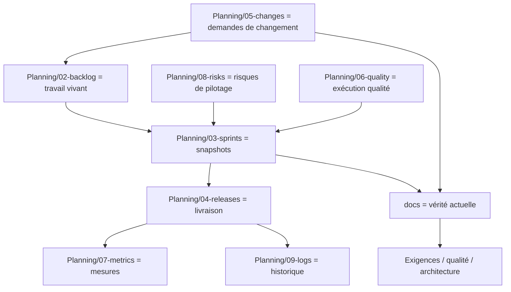

Oui, je pense qu’il y a une **meilleure façon d’architecturer `Planning/`** que ce que j’ai proposé juste avant.

La version précédente était bonne pour **ne rien oublier**, mais elle risque d’être trop lourde. Le vrai risque, c’est que chaque sprint devienne un énorme dossier avec trop de fichiers, que l’équipe ne les remplisse plus correctement, et que `Planning/` duplique `docs/`.

Donc je corrige mon avis :

> La meilleure architecture n’est pas “un gros dossier sprint qui contient tout”.
> La meilleure architecture est un **système de registres + snapshots de sprint + preuves qualité**.

---

# 1. Le principe à garder

Il faut séparer clairement trois choses :

```text
docs/      = vérité actuelle du produit
Planning/  = historique de pilotage et d’exécution
code/      = implémentation
```

Le `Planning/` ne doit pas refaire le travail de `docs/`.

Il doit répondre à :

```text
Qu’est-ce qu’on a décidé de faire ?
Quand ?
Pourquoi ?
Avec quels risques ?
Avec quelle qualité attendue ?
Qu’est-ce qui a changé ?
Qu’est-ce qui a été livré ?
Qu’est-ce qui reste ouvert ?
```

Scrum distingue déjà Product Backlog, Sprint Backlog et Increment, avec Product Goal, Sprint Goal et Definition of Done comme engagements associés. Ça confirme l’idée qu’il faut garder une séparation entre la vision produit, le travail sélectionné pour un sprint, et l’incrément terminé. ([Scrum Guides][1])

---

# 2. Ce que je changerais

Je ne mettrais pas tous les éléments détaillés dans chaque sprint.

Je ferais plutôt ceci :

```text
Planning/
├── README.md
├── _templates/
├── 00-dashboard/
├── 01-roadmap/
├── 02-backlog/
├── 03-sprints/
├── 04-releases/
├── 05-changes/
├── 06-quality/
├── 07-metrics/
├── 08-risks/
├── 09-logs/
└── 99-archive/
```

Pourquoi c’est mieux ?

Parce que :

```text
- le backlog vit dans un seul endroit ;
- les changements vivent dans un seul endroit ;
- les risques vivent dans un seul endroit ;
- les sprints ne font que référencer ces éléments ;
- les releases ont leur propre dossier ;
- la qualité a son propre registre ;
- l’historique reste lisible.
```

---

# 3. Architecture recommandée de `Planning/`

## Version finale proposée

```text
Planning/
├── README.md
│
├── _templates/
│   ├── sprint-plan.template.md
│   ├── sprint-closeout.template.md
│   ├── backlog-item.template.md
│   ├── change-request.template.md
│   ├── release-readiness.template.md
│   ├── quality-execution.template.md
│   ├── risk-register-entry.template.md
│   └── decision-log-entry.template.md
│
├── 00-dashboard/
│   ├── current-status.md
│   ├── current-sprint.md
│   ├── current-risks.md
│   ├── current-quality-status.md
│   ├── current-release-status.md
│   └── open-decisions.md
│
├── 01-roadmap/
│   ├── roadmap-current.md
│   ├── milestones.md
│   ├── product-increments.md
│   └── roadmap-history.md
│
├── 02-backlog/
│   ├── backlog-index.md
│   ├── epics/
│   ├── items/
│   ├── spikes/
│   ├── bugs/
│   ├── tech-debt/
│   ├── quality-debt/
│   └── icebox/
│
├── 03-sprints/
│   └── 2026/
│       ├── SPRINT-001_2026-05-04_to_2026-05-15/
│       ├── SPRINT-002_2026-05-18_to_2026-05-29/
│       └── SPRINT-003_2026-06-01_to_2026-06-12/
│
├── 04-releases/
│   ├── release-index.md
│   ├── REL-001/
│   ├── REL-002/
│   └── release-history.md
│
├── 05-changes/
│   ├── change-index.md
│   ├── active/
│   ├── accepted/
│   ├── rejected/
│   ├── deferred/
│   └── superseded/
│
├── 06-quality/
│   ├── quality-control-matrix.md
│   ├── sprint-quality-index.md
│   ├── quality-gates-results.md
│   ├── defect-escape-analysis.md
│   ├── regression-history.md
│   ├── flaky-tests-register.md
│   └── quality-debt-register.md
│
├── 07-metrics/
│   ├── metrics-dashboard.md
│   ├── dora-metrics.md
│   ├── sprint-metrics.md
│   ├── quality-metrics.md
│   ├── stability-metrics.md
│   └── release-metrics.md
│
├── 08-risks/
│   ├── risk-register.md
│   ├── product-risks.md
│   ├── technical-risks.md
│   ├── security-risks.md
│   ├── data-risks.md
│   └── accepted-risks.md
│
├── 09-logs/
│   ├── decision-log.md
│   ├── planning-log.md
│   ├── scope-log.md
│   └── dependency-log.md
│
└── 99-archive/
```

Cette architecture est plus solide parce qu’elle évite de répéter la même information partout.

---

# 4. Le changement principal : les sprints ne doivent pas contenir tout

Dans la version précédente, chaque sprint avait trop de fichiers.

Je ferais plutôt un dossier sprint plus compact :

```text
Planning/03-sprints/2026/SPRINT-001_2026-05-04_to_2026-05-15/
├── 00-sprint-plan.md
├── 01-selected-work.md
├── 02-quality-execution.md
├── 03-changes-during-sprint.md
├── 04-test-and-validation-results.md
├── 05-sprint-review.md
├── 06-sprint-closeout.md
├── 07-retrospective.md
└── evidence/
    ├── test-reports/
    ├── screenshots/
    ├── validation-notes/
    └── ci-reports/
```

C’est largement suffisant.

Le sprint doit contenir :

```text
- le plan ;
- le travail sélectionné ;
- l’exécution qualité ;
- les changements apparus ;
- les résultats de test ;
- la review ;
- la clôture ;
- la rétro ;
- les preuves.
```

Le reste doit être référencé, pas recopié.

---

# 5. Le meilleur modèle : registres + snapshots

La bonne architecture est celle-ci :

```text
Backlog item = fichier vivant
Change request = fichier vivant
Risk = fichier vivant
Quality control = fichier vivant
Sprint = snapshot historique
Release = snapshot de livraison
```

Exemple :

```text
Planning/02-backlog/items/PBI-001-consulter-transmission.md
Planning/05-changes/accepted/CHG-004-public-access.md
Planning/08-risks/security-risks/RISK-003-access-control.md
Planning/03-sprints/2026/SPRINT-004/01-selected-work.md
Planning/04-releases/REL-002/release-readiness.md
```

Le sprint ne réécrit pas `PBI-001`.
Il dit seulement :

```text
Ce sprint a sélectionné PBI-001, PBI-002, CHG-004.
```

Et il ajoute :

```text
Ce qui a été fait.
Ce qui n’a pas été fait.
Les preuves.
Les écarts.
```

---

# 6. Pourquoi c’est meilleur

## Mauvaise architecture

```text
Chaque sprint contient tout :
- exigences ;
- risques ;
- décisions ;
- tests ;
- changements ;
- métriques ;
- release ;
- backlog.
```

Problème :

```text
- duplication ;
- fichiers trop longs ;
- informations contradictoires ;
- maintenance lourde ;
- équipe qui arrête de documenter ;
- difficulté à savoir quelle version est vraie.
```

## Bonne architecture

```text
Les objets importants vivent dans leur registre.
Les sprints les référencent.
Les releases les figent.
Git garde l’historique.
```

Avantages :

```text
- moins de duplication ;
- meilleure traçabilité ;
- documentation plus légère ;
- historique propre ;
- meilleure maintenabilité ;
- plus compatible agile ;
- plus facile à automatiser.
```

---

# 7. Structure idéale d’un sprint

## `00-sprint-plan.md`

```md
---
id: SPRINT-001
status: planned
start_date: 2026-05-04
end_date: 2026-05-15
sprint_goal: "Sécuriser la consultation des transmissions patient"
product_goal_ref: docs/02-product-vision/product-goal.md
start_commit: "<sha>"
owner: product-owner
qa_owner: qa-lead
tech_owner: tech-lead
---

# Sprint Plan — SPRINT-001

## Sprint Goal

## Pourquoi ce sprint existe

## Travail sélectionné

Voir `01-selected-work.md`.

## Hypothèses

## Contraintes

## Risques principaux

## Qualité attendue

## Critères de réussite

## Critères d’échec

## Décisions ouvertes
```

---

## `01-selected-work.md`

```md
# Selected Work — SPRINT-001

| ID | Type | Titre | Priorité | Exigences | Risques | Tests attendus | Statut |
|---|---|---|---|---|---|---|---|
| PBI-001 | Feature | Consulter transmission | High | REQ-001 | RISK-003 | TEST-010, TEST-011 | Planned |
| SPIKE-001 | Spike | Vérifier API publique | Medium | CHG-004 | RISK-011 | Rapport spike | Planned |
| BUG-003 | Bug | Erreur filtre unité | High | REQ-001 | RISK-003 | TEST-011 | Planned |
```

Le détail de chaque item reste dans :

```text
Planning/02-backlog/
```

---

## `02-quality-execution.md`

C’est le fichier central.

```md
# Quality Execution — SPRINT-001

| Contrôle | Applicable | Statut | Preuve | Commentaire |
|---|---:|---|---|---|
| QCTRL-001 Quality objectives | Oui | Pass | 00-sprint-plan.md | Objectifs définis |
| QCTRL-002 Requirement clarity | Oui | Pass | PBI-001 | AC présents |
| QCTRL-003 Risk analysis | Oui | Pass | RISK-003 | Mitigation définie |
| QCTRL-004 Design review | Oui | Pass | ADR-003 | Décision documentée |
| QCTRL-005 Test strategy | Oui | Pass | 04-test-and-validation-results.md | Tests liés |
| QCTRL-006 Data/envs | Oui | Pass | TEST-DATA-001 | Données prêtes |
| QCTRL-007 Dev quality | Oui | Pass | PR-123 | DoD respectée |
| QCTRL-008 Code review | Oui | Pass | PR-123 | Review faite |
| QCTRL-009 CI gates | Oui | Pass | CI run | Verte |
| QCTRL-010 Security | Oui | Pass | security-checks | OK |
| QCTRL-011 Performance | Non | N/A | Justification | Aucun impact perf |
| QCTRL-012 Migration | Non | N/A | Justification | Pas de migration |
| QCTRL-013 QA validation | Oui | Pass | 04-test-and-validation-results.md | QA OK |
| QCTRL-014 Regression | Oui | Pass | CI run | Régression OK |
| QCTRL-015 Release readiness | Oui | Pending | REL-001 | En attente |
| QCTRL-016 Deployment stability | Oui | Pending | REL-001 | En attente |
| QCTRL-017 Observability | Oui | Pass | monitoring.md | Logs ajoutés |
| QCTRL-018 Bugs/incidents | Oui | Pass | BUG register | Aucun critique |
| QCTRL-019 Quality retro | Oui | Pending | 07-retrospective.md | Fin sprint |
| QCTRL-020 Metrics | Oui | Pending | metrics | Fin sprint |
| QCTRL-021 AI controls | Non | N/A | Justification | Pas d’IA utilisée |
| QCTRL-022 Cycle checklist | Oui | Pass | ce fichier | OK |
| QCTRL-023 Stability practices | Oui | Pass | rollback plan | OK |
| QCTRL-024 Anti-patterns | Oui | Pass | 07-retrospective.md | À vérifier |
```

C’est ce fichier qui répond à :

> Est-ce que le sprint a couvert le référentiel qualité ?

---

## `03-changes-during-sprint.md`

```md
# Changes During Sprint

| Date | Changement | Origine | Décision | Impact Sprint Goal | Action |
|---|---|---|---|---|---|
| 2026-05-07 | CHG-004 | MOA | Analyse | Moyen | Spike créé |
```

Règle :

```text
Aucun changement significatif ne doit être seulement oral.
```

---

## `04-test-and-validation-results.md`

```md
# Test and Validation Results

## Résumé

## Tests automatisés

| Test | Couvre | Résultat | Preuve |
|---|---|---|---|
| TEST-010 | REQ-001 | Pass | CI |
| TEST-011 | RISK-003 | Pass | CI |

## Tests manuels

## Tests non réalisés

## Bugs trouvés

## Risques restants

## Recommandation QA

Go / No-Go / Go avec réserve
```

---

## `06-sprint-closeout.md`

```md
---
id: SPRINT-001-CLOSEOUT
status: closed
end_commit: "<sha>"
---

# Sprint Closeout

## Sprint Goal atteint ?

Oui / Non / Partiellement

## Livré

## Non livré

## Retourné au backlog

## Changements acceptés

## Décisions prises

## Qualité

## Tests

## Dette créée

## Dette remboursée

## Impact release

## Points ouverts

## Actions obligatoires avant prochain sprint
```

---

# 8. Où mettre les changements ?

Je mettrais les changements dans `Planning/05-changes/`, pas dans `docs/14-changes/`.

Pourquoi ?

Parce qu’un changement est d’abord un objet de pilotage : il peut être accepté, rejeté, reporté ou analysé. Il ne devient une documentation produit officielle que s’il est accepté et intégré.

Donc :

```text
Planning/05-changes/active/CHG-004-public-access.md
```

Puis si accepté :

```text
docs/02-product-vision/scope.md
docs/04-requirements/...
docs/07-architecture/...
docs/08-quality/...
```

sont mis à jour.

Le changement reste dans `Planning/05-changes/accepted/` comme trace historique.

---

# 9. Où mettre les risques ?

Je mettrais les risques projet/sprint dans `Planning/08-risks/`.

Et les risques produit permanents dans `docs/08-quality/` ou `docs/09-security-compliance/`.

Donc :

```text
Planning/08-risks/
```

pour :

```text
- risque planning ;
- risque sprint ;
- risque de dépendance ;
- risque d’estimation ;
- risque de delivery ;
- risque temporaire.
```

Et :

```text
docs/09-security-compliance/
docs/08-quality/
docs/06-data/
```

pour :

```text
- risque sécurité permanent ;
- risque qualité permanent ;
- risque données permanent ;
- risque conformité permanent.
```

Exemple :

```text
Planning/08-risks/RISK-PLANNING-004-dependance-dsi.md
docs/09-security-compliance/threat-model.md
docs/06-data/data-risk-analysis.md
```

---

# 10. Où mettre les décisions ?

Je garderais les décisions importantes dans `docs/13-decisions/`.

Mais je mettrais un index court dans :

```text
Planning/09-logs/decision-log.md
```

Pourquoi ?

Parce que les ADR/PDR/QDR sont des documents de référence.
Mais le planning a besoin d’un journal chronologique.

Donc :

```text
docs/13-decisions/ADR-003-separate-public-private-routes.md
```

et dans :

```text
Planning/09-logs/decision-log.md
```

on ajoute :

```text
2026-05-07 | ADR-003 | Séparer routes publiques/privées | SPRINT-004 | CHG-004
```

Les ADR sont une méthode reconnue pour conserver les décisions architecturales significatives, leur contexte et leurs conséquences. Michael Nygard les décrit comme des enregistrements de décisions qui affectent la structure, les caractéristiques non fonctionnelles, les dépendances, les interfaces ou les techniques de construction. ([Architectural Decision Records][2])

---

# 11. Où mettre la qualité ?

Je ferais deux niveaux.

## Référentiel qualité

Dans :

```text
docs/08-quality/
```

Exemples :

```text
quality-strategy.md
quality-gates.md
quality-control-model.md
risk-based-testing.md
regression-strategy.md
quality-metrics.md
```

## Exécution qualité

Dans :

```text
Planning/06-quality/
Planning/03-sprints/.../02-quality-execution.md
```

Exemples :

```text
Planning/06-quality/quality-control-matrix.md
Planning/06-quality/sprint-quality-index.md
Planning/03-sprints/2026/SPRINT-001/02-quality-execution.md
```

Donc :

```text
docs/08-quality = règles du jeu
Planning/06-quality = résultats et suivi
```

---

# 12. Où mettre les métriques ?

Les métriques doivent être dans `Planning/07-metrics/`.

Pourquoi ?

Parce qu’elles mesurent l’exécution et la stabilité dans le temps.

```text
Planning/07-metrics/
├── metrics-dashboard.md
├── dora-metrics.md
├── sprint-metrics.md
├── quality-metrics.md
├── stability-metrics.md
└── release-metrics.md
```

DORA utilise notamment des métriques comme le change failure rate pour mesurer l’instabilité de livraison, et recommande de garder les fondamentaux comme petits lots et tests robustes pour préserver la stabilité. ([dora.dev][3])

---

# 13. Où mettre les releases ?

Les releases doivent être séparées des sprints.

Un sprint produit un incrément.
Une release met quelque chose en production.

Ce n’est pas toujours la même chose.

```text
Planning/04-releases/
├── release-index.md
├── REL-001/
│   ├── release-plan.md
│   ├── release-readiness.md
│   ├── release-notes.md
│   ├── rollback-plan.md
│   ├── deployment-evidence.md
│   ├── post-deploy-validation.md
│   └── release-retrospective.md
└── REL-002/
```

C’est important parce que :

```text
- plusieurs sprints peuvent alimenter une release ;
- un sprint peut ne rien livrer en production ;
- une release peut être rollbackée ;
- une release peut générer un incident ;
- la stabilité se mesure surtout après release.
```

---

# 14. Le vrai schéma cible



---

# 15. La règle qui rend l’architecture saine

La règle à appliquer :

```text
Un fichier ne doit avoir qu’une responsabilité.
```

Donc :

```text
Le backlog item décrit le travail.
Le sprint décrit l’exécution.
Le changement décrit la demande.
La décision décrit le choix.
La release décrit la livraison.
La métrique décrit le résultat.
La doc décrit l’état actuel du produit.
```

Si un sprint recopie toute l’exigence, c’est mauvais.

Le sprint doit seulement dire :

```text
PBI-001 a été sélectionné.
REQ-001 a été impactée.
TEST-011 est passé.
PR-123 a été mergée.
REL-002 inclura ce changement.
```

---

# 16. Version “meilleure” du repo complet

```text
repo/
├── README.md
├── CONTRIBUTING.md
├── CODEOWNERS
├── .github/
│   ├── pull_request_template.md
│   └── workflows/
│
├── docs/
│   ├── 00-index/
│   ├── 01-governance/
│   ├── 02-product-vision/
│   ├── 03-discovery/
│   ├── 04-requirements/
│   ├── 05-domain/
│   ├── 06-data/
│   ├── 07-architecture/
│   ├── 08-quality/
│   ├── 09-security-compliance/
│   ├── 10-testing/
│   ├── 11-operations/
│   ├── 12-user-docs/
│   ├── 13-decisions/
│   └── 90-templates/
│
├── Planning/
│   ├── README.md
│   ├── _templates/
│   ├── 00-dashboard/
│   ├── 01-roadmap/
│   ├── 02-backlog/
│   ├── 03-sprints/
│   ├── 04-releases/
│   ├── 05-changes/
│   ├── 06-quality/
│   ├── 07-metrics/
│   ├── 08-risks/
│   ├── 09-logs/
│   └── 99-archive/
│
├── apps/
├── packages/
├── services/
├── libs/
├── contracts/
├── infra/
├── database/
├── tests/
└── scripts/
```

C’est plus propre que la version précédente.

---

# 17. Les automatisations restent indispensables

Même avec une meilleure structure, ça ne tient pas sans contrôle automatique.

Il faut des checks GitHub pour vérifier :

```text
- chaque PR référence au moins un PBI ou CHG ;
- chaque exigence active a un owner ;
- chaque exigence critique a un test ;
- chaque risque élevé a une mitigation ;
- chaque changement accepté a une analyse d’impact ;
- chaque sprint clôturé a un closeout ;
- chaque release a une release readiness ;
- aucun secret n’est commité ;
- les documents critiques ont des métadonnées valides.
```

GitHub permet d’imposer des status checks et des reviews avant merge via les protections de branche, et CODEOWNERS peut imposer la revue par les propriétaires des fichiers modifiés. ([GitHub Docs][4])

---

# 18. Ma réponse honnête

Non, je ne dirais pas que la version précédente était “parfaite”.

Elle était :

```text
complète ;
traçable ;
très orientée qualité ;
mais trop lourde pour être maintenue facilement.
```

La meilleure version est celle-ci :

```text
Planning comme système de pilotage,
pas comme deuxième documentation produit.
```

Donc oui, je changerais surtout `Planning/`.

Je garderais :

```text
docs/ = vérité actuelle
```

Mais je transformerais `Planning/` en :

```text
dashboard + roadmap + backlog + sprints + releases + changes + quality + metrics + risks + logs
```

Et je simplifierais chaque dossier sprint à :

```text
00-sprint-plan.md
01-selected-work.md
02-quality-execution.md
03-changes-during-sprint.md
04-test-and-validation-results.md
05-sprint-review.md
06-sprint-closeout.md
07-retrospective.md
evidence/
```

C’est, à mon avis, l’architecture la plus robuste : **moins de duplication, plus de traçabilité, plus facile à maintenir, et plus réaliste pour une équipe agile**.

[1]: https://scrumguides.org/scrum-guide.html?utm_source=chatgpt.com "The 2020 Scrum Guide TM"
[2]: https://adr.github.io/?utm_source=chatgpt.com "Architectural Decision Records"
[3]: https://dora.dev/research/2024/dora-report/?utm_source=chatgpt.com "DORA | Accelerate State of DevOps Report 2024"
[4]: https://docs.github.com/repositories/configuring-branches-and-merges-in-your-repository/managing-protected-branches/about-protected-branches?utm_source=chatgpt.com "About protected branches"
