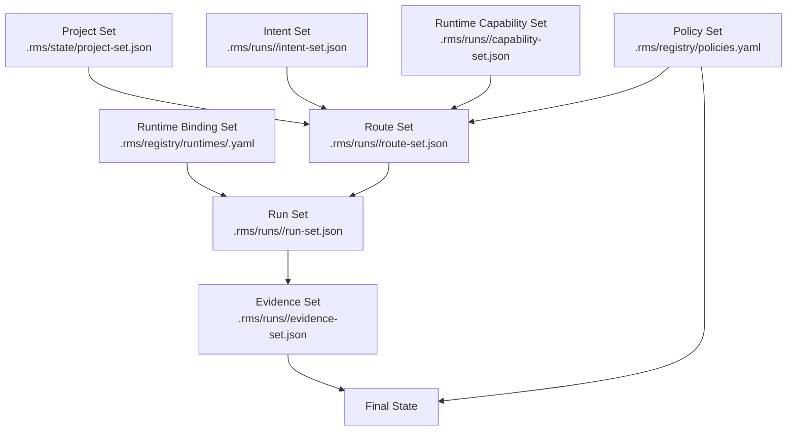

# RMS Canonical Sets — Formal Schemas

> **Status**: conception v1
> **Source**: `propositions/rms-runtime-sets-v1-draft.md`, `research-reports/checkpoint-implementation.md`
> **Purpose**: TypeScript interfaces + JSON Schema (draft 2020-12) for all 8 canonical RMS sets.
> These schemas are the authoritative contract for type generation and runtime validation.

---

## Table of Contents

1. [Set Relationships Diagram](#set-relationships-diagram)
2. [Project Set](#1-project-set)
3. [Intent Set](#2-intent-set)
4. [Runtime Capability Set](#3-runtime-capability-set)
5. [Runtime Binding Set](#4-runtime-binding-set)
6. [Policy Set](#5-policy-set)
7. [Route Set](#6-route-set)
8. [Run Set](#7-run-set)
9. [Evidence Set](#8-evidence-set)
10. [Cross-Set Validation Rules](#cross-set-validation-rules)
11. [Minimum Viable Evidence Set](#minimum-viable-evidence-set)
12. [Storage Location Decision](#storage-location-decision)

---

## Set Relationships Diagram



**Flow narrative**: Project context + current intent + detected runtime capabilities + active policy are
combined by the RMS router to produce a Route Set. The Route Set, translated through runtime-specific
Bindings, drives the actual execution that populates the Run Set. Execution events and subagent outputs
accumulate in the Evidence Set. Policy gates are re-applied to Evidence + Run state to authorize the
Final State transition.

---

## 1. Project Set

### Purpose

The Project Set is the stable, long-lived ground truth for a repository. It captures what this project
is, what it is not, which quality standards apply, and where code, tests, and docs live. It does not
hold live execution state — it answers the question "what kind of project is this and what does it
require?" regardless of which run is currently active. Think of it as the Project Constitution: changes
to it are deliberate and rare, always structural, and must be reviewed before merging.

### Lifecycle

- **Created**: once, during `harness init`
- **Updated**: on deliberate architectural decisions (new standard, renamed path, changed risk policy)
- **Who updates**: harness CLI (`harness set-project`) or developer directly; never mutated by agents
  during a run
- **Frequency**: days to weeks between updates

### TypeScript Interface

```typescript
/** Immutable ground truth for the repository. Never modified during a run. */
export interface ProjectSet {
  /** Schema version for forward compatibility. */
  schemaVersion: "1.0";

  /** Short, stable identifier for the project (kebab-case, no spaces). */
  projectId: string;

  /** Human-readable project name. */
  name: string;

  /** One-sentence product/system vision. */
  vision: string;

  /** Primary platform signal detected or set at init time. */
  platform: "next" | "nestjs" | "expo" | "swift-ios" | "kotlin-android" | "kmp" | "other";

  /** Architectural constraints the RMS must respect. */
  architectureConstraints: string[];

  /** Active quality standards with their references. */
  qualityStandards: QualityStandard[];

  /** Repository layout conventions. */
  repoPaths: RepoPaths;

  /** Security and compliance policies active for this project. */
  securityPolicies: SecurityPolicy[];

  /** Risk class overrides for specific path patterns. */
  pathRiskOverrides: PathRiskOverride[];

  /** ISO 8601 timestamp of last update. */
  updatedAt: string;

  /** Git SHA when this set was last updated. */
  updatedAtCommit?: string;
}

export interface QualityStandard {
  /** Identifier: "iso-25010", "owasp-asvs", "wcag-2.2", "dora", etc. */
  id: string;
  /** Short description of how this standard is applied on this project. */
  scope: string;
  /** Minimum threshold or level required. E.g. "level 2", "90% conformance". */
  threshold?: string;
}

export interface RepoPaths {
  /** Source code root. Default: "src/". */
  src: string;
  /** Test files root. Default: "tests/" or colocated. */
  tests: string;
  /** Product documentation root. Default: "docs/". */
  docs: string;
  /** Execution planning root. Default: ".planning/". */
  planning: string;
  /** RMS state root. Default: ".rms/". */
  rms: string;
}

export interface SecurityPolicy {
  /** Policy name: "no-secrets-in-code", "pii-review-required", etc. */
  name: string;
  /** Risk classes this policy applies to. */
  appliesTo: RiskClass[];
  /** Whether violation is blocking or warning. */
  enforcement: "blocking" | "warning";
}

export interface PathRiskOverride {
  /** Glob pattern, e.g. "src/auth/**". */
  glob: string;
  /** Minimum risk class forced for any change touching this path. */
  minimumRiskClass: RiskClass;
  /** Reason for the override. */
  reason: string;
}

export type RiskClass = "T" | "F" | "M" | "E" | "C";
```

### JSON Schema

```json
{
  "$schema": "https://json-schema.org/draft/2020-12/schema",
  "$id": "https://harness.dev/schemas/rms/project-set.json",
  "title": "ProjectSet",
  "type": "object",
  "required": ["schemaVersion", "projectId", "name", "vision", "platform",
               "architectureConstraints", "qualityStandards", "repoPaths",
               "securityPolicies", "pathRiskOverrides", "updatedAt"],
  "additionalProperties": false,
  "properties": {
    "schemaVersion": { "type": "string", "const": "1.0" },
    "projectId":     { "type": "string", "pattern": "^[a-z0-9-]+$" },
    "name":          { "type": "string", "minLength": 1 },
    "vision":        { "type": "string", "minLength": 1 },
    "platform": {
      "type": "string",
      "enum": ["next", "nestjs", "expo", "swift-ios", "kotlin-android", "kmp", "other"]
    },
    "architectureConstraints": { "type": "array", "items": { "type": "string" } },
    "qualityStandards": {
      "type": "array",
      "items": {
        "type": "object",
        "required": ["id", "scope"],
        "properties": {
          "id":        { "type": "string" },
          "scope":     { "type": "string" },
          "threshold": { "type": "string" }
        },
        "additionalProperties": false
      }
    },
    "repoPaths": {
      "type": "object",
      "required": ["src", "tests", "docs", "planning", "rms"],
      "properties": {
        "src":      { "type": "string" },
        "tests":    { "type": "string" },
        "docs":     { "type": "string" },
        "planning": { "type": "string" },
        "rms":      { "type": "string" }
      },
      "additionalProperties": false
    },
    "securityPolicies": {
      "type": "array",
      "items": {
        "type": "object",
        "required": ["name", "appliesTo", "enforcement"],
        "properties": {
          "name":        { "type": "string" },
          "appliesTo":   { "type": "array", "items": { "$ref": "#/$defs/riskClass" } },
          "enforcement": { "type": "string", "enum": ["blocking", "warning"] }
        },
        "additionalProperties": false
      }
    },
    "pathRiskOverrides": {
      "type": "array",
      "items": {
        "type": "object",
        "required": ["glob", "minimumRiskClass", "reason"],
        "properties": {
          "glob":             { "type": "string" },
          "minimumRiskClass": { "$ref": "#/$defs/riskClass" },
          "reason":           { "type": "string" }
        },
        "additionalProperties": false
      }
    },
    "updatedAt":       { "type": "string", "format": "date-time" },
    "updatedAtCommit": { "type": "string", "pattern": "^[0-9a-f]{7,40}$" }
  },
  "$defs": {
    "riskClass": { "type": "string", "enum": ["T", "F", "M", "E", "C"] }
  }
}
```

### Example

```json
{
  "schemaVersion": "1.0",
  "projectId": "claude-code-harness",
  "name": "Pipeline Fractale Harness",
  "vision": "A TypeScript control plane that imposes quality-gated development cycles on any AI coding agent runtime.",
  "platform": "next",
  "architectureConstraints": [
    "No daemon process — hooks call harness binary inline",
    "State lives in .rms/ at repo root, not in node_modules",
    "Money fields must use integer cents, never float"
  ],
  "qualityStandards": [
    { "id": "owasp-asvs", "scope": "All auth and PII flows", "threshold": "level 2" },
    { "id": "wcag-2.2",   "scope": "All UI components", "threshold": "AA" },
    { "id": "dora",       "scope": "CI/CD pipeline", "threshold": "elite tier" }
  ],
  "repoPaths": {
    "src":      "packages/",
    "tests":    "packages/*/src/**/*.test.ts",
    "docs":     "docs/",
    "planning": ".planning/",
    "rms":      ".rms/"
  },
  "securityPolicies": [
    { "name": "no-secrets-in-code", "appliesTo": ["T","F","M","E","C"], "enforcement": "blocking" },
    { "name": "pii-review-required", "appliesTo": ["E","C"], "enforcement": "blocking" }
  ],
  "pathRiskOverrides": [
    { "glob": "packages/adapter-*/src/**", "minimumRiskClass": "M",
      "reason": "Adapter changes affect all runtime bindings" },
    { "glob": "packages/core/src/gates/**", "minimumRiskClass": "E",
      "reason": "Gate changes affect security enforcement across all platforms" }
  ],
  "updatedAt": "2026-05-03T10:00:00Z",
  "updatedAtCommit": "a3f1c29"
}
```

### Constraints

- `projectId` must match `^[a-z0-9-]+$` — used as a directory-safe identifier
- `repoPaths.rms` must not equal `repoPaths.planning` — they are separate territories
- `pathRiskOverrides[*].minimumRiskClass` must be F, M, E, or C (T is not meaningful as a minimum)
- No agent may write to this file during a run; gate `gate.pre_tool` must block writes to the
  Project Set path

### Storage

- **Path**: `.rms/state/project-set.json`
- **Format**: JSON (machine-written by `harness init`, human-editable between runs)
- **Versioning**: committed to git; diff on update is the change record
- **Singleton**: one per repo root (not per workspace)

---

## 2. Intent Set

### Purpose

The Intent Set captures the developer's request for the current run with enough precision that the RMS
can choose a pipeline, classify risk, and detect ambiguity — without requiring the developer to fill a
form. It answers "what does the user actually want to do right now, what is in scope, and what is
explicitly not in scope?" It is created fresh for every run and discarded when the run reaches a
terminal Final State. Its primary consumers are the Route Set computation and the policy gate that
decides whether autonomous execution is permitted.

### Lifecycle

- **Created**: at run start, from the user's prompt (by the harness `user_prompt_submit` hook)
- **Updated**: if scope is reclassified mid-run (e.g., class promoted from F to E on discovery)
- **Who updates**: harness classifier; developer for manual overrides
- **Frequency**: once per run, with at most one scope-promotion update

### TypeScript Interface

```typescript
/** Captures the developer's intent for a single run. One instance per run. */
export interface IntentSet {
  schemaVersion: "1.0";

  /** Globally unique run identifier (UUIDv4). */
  runId: string;

  /** ISO 8601 timestamp when this intent was captured. */
  capturedAt: string;

  /** Verbatim user prompt (truncated at 2000 chars if longer). */
  rawPrompt: string;

  /** RMS-interpreted objective in one sentence. */
  interpretedObjective: string;

  /** What this run will change or produce. */
  inScope: string[];

  /** Explicitly deferred or out of scope. */
  notInScope: string[];

  /** Ambiguities detected. Empty if none. */
  ambiguities: Ambiguity[];

  /** Initial risk classification assigned by the classifier. */
  initialRiskClass: RiskClass;

  /** Final risk class after path-override and promotion checks. */
  effectiveRiskClass: RiskClass;

  /** Whether risk was promoted mid-run. */
  riskPromoted: boolean;

  /** Autonomy level the developer authorized for this run. */
  authorizedAutonomy: "pairing" | "auto-decision" | "bypass";

  /** Expected deliverable type. */
  deliverableType: "feature" | "bugfix" | "refactor" | "spike" | "doc" | "config" | "release";

  /** Developer-provided Definition of Done, if any. Null means use policy default. */
  explicitDoD: string | null;

  /** Pipeline cycles the RMS plans to traverse. */
  plannedCycles: PipelineCycle[];
}

export interface Ambiguity {
  /** Short description of what is unclear. */
  description: string;
  /** RMS assumption taken to proceed. */
  assumption: string;
  /** Impact if the assumption is wrong. */
  impact: "low" | "medium" | "high";
}

export type PipelineCycle =
  | "discovery"
  | "cadrage"
  | "conception"
  | "build"
  | "validation"
  | "release"
  | "run"
  | "learning";
```

### JSON Schema

```json
{
  "$schema": "https://json-schema.org/draft/2020-12/schema",
  "$id": "https://harness.dev/schemas/rms/intent-set.json",
  "title": "IntentSet",
  "type": "object",
  "required": ["schemaVersion", "runId", "capturedAt", "rawPrompt",
               "interpretedObjective", "inScope", "notInScope", "ambiguities",
               "initialRiskClass", "effectiveRiskClass", "riskPromoted",
               "authorizedAutonomy", "deliverableType", "explicitDoD", "plannedCycles"],
  "additionalProperties": false,
  "properties": {
    "schemaVersion":         { "type": "string", "const": "1.0" },
    "runId":                 { "type": "string", "format": "uuid" },
    "capturedAt":            { "type": "string", "format": "date-time" },
    "rawPrompt":             { "type": "string", "maxLength": 2000 },
    "interpretedObjective":  { "type": "string" },
    "inScope":               { "type": "array", "items": { "type": "string" }, "minItems": 1 },
    "notInScope":            { "type": "array", "items": { "type": "string" } },
    "ambiguities": {
      "type": "array",
      "items": {
        "type": "object",
        "required": ["description", "assumption", "impact"],
        "properties": {
          "description": { "type": "string" },
          "assumption":  { "type": "string" },
          "impact":      { "type": "string", "enum": ["low", "medium", "high"] }
        },
        "additionalProperties": false
      }
    },
    "initialRiskClass":   { "$ref": "#/$defs/riskClass" },
    "effectiveRiskClass": { "$ref": "#/$defs/riskClass" },
    "riskPromoted":       { "type": "boolean" },
    "authorizedAutonomy": { "type": "string", "enum": ["pairing", "auto-decision", "bypass"] },
    "deliverableType": {
      "type": "string",
      "enum": ["feature", "bugfix", "refactor", "spike", "doc", "config", "release"]
    },
    "explicitDoD": { "type": ["string", "null"] },
    "plannedCycles": {
      "type": "array",
      "items": {
        "type": "string",
        "enum": ["discovery","cadrage","conception","build","validation","release","run","learning"]
      },
      "minItems": 1
    }
  },
  "$defs": {
    "riskClass": { "type": "string", "enum": ["T", "F", "M", "E", "C"] }
  }
}
```

### Example

```json
{
  "schemaVersion": "1.0",
  "runId": "f47ac10b-58cc-4372-a567-0e02b2c3d479",
  "capturedAt": "2026-05-03T14:32:00Z",
  "rawPrompt": "Add a --watch flag to the harness status command that refreshes every 5 seconds",
  "interpretedObjective": "Extend `packages/cli/src/commands/status.ts` with a --watch flag using setInterval for periodic refresh.",
  "inScope": [
    "Add --watch / -w CLI flag to status command",
    "Implement 5-second polling loop with clean exit on SIGINT",
    "Update status command help text"
  ],
  "notInScope": [
    "WebSocket-based live refresh",
    "Configurable refresh interval (hardcoded 5s for now)",
    "status command output format changes"
  ],
  "ambiguities": [
    {
      "description": "Whether --watch should clear the terminal between refreshes",
      "assumption": "Yes, use process.stdout.write('\\x1Bc') for clean output",
      "impact": "low"
    }
  ],
  "initialRiskClass": "F",
  "effectiveRiskClass": "F",
  "riskPromoted": false,
  "authorizedAutonomy": "auto-decision",
  "deliverableType": "feature",
  "explicitDoD": null,
  "plannedCycles": ["build", "validation"]
}
```

### Constraints

- `runId` must be a valid UUIDv4 and unique across all runs in `.rms/runs/`
- `effectiveRiskClass` >= `initialRiskClass` (never downgraded, only promoted)
- If `effectiveRiskClass` is "E" or "C", `authorizedAutonomy` must not be "bypass"
- `inScope` must have at least one item
- `plannedCycles` must include "build" if `deliverableType` is "feature" or "bugfix"

### Storage

- **Path**: `.rms/runs/<runId>/intent-set.json`
- **Format**: JSON
- **Versioning**: immutable once created; a scope-promotion creates a new `intent-set-v2.json`
  alongside the original for audit trail

---

## 3. Runtime Capability Set

### Purpose

The Runtime Capability Set is an inventory of what the currently active coding agent runtime can
actually do at the moment of this run — not what it theoretically supports, but what is confirmed
present, configured, and accessible. It answers "what tools are available to execute this route?"
and prevents the RMS from routing to capabilities that do not exist. Critically, this set must be
produced by inspection when possible, not assumed from documentation. A runtime that lacks a
required capability must cause the RMS to emit `BLOCKED_RUNTIME_MISSING` rather than silently
degrading.

### Lifecycle

- **Created**: at run start, immediately after intent capture, by the capability probe
- **Updated**: never during a run (snapshot at probe time)
- **Who updates**: `harness hook session-start` capability probe script
- **Frequency**: once per run; may be cached per session if session is short (< 30 min)

### TypeScript Interface

```typescript
/** Snapshot of what the active runtime can do at run start. Immutable during a run. */
export interface RuntimeCapabilitySet {
  schemaVersion: "1.0";

  /** Run this capability set belongs to. */
  runId: string;

  /** ISO 8601 timestamp of probe. */
  probedAt: string;

  /** Active runtime identifier. */
  runtime: "claude" | "codex" | "hermes" | "unknown";

  /** Detected version string. Null if not detectable. */
  runtimeVersion: string | null;

  /** Host OS. */
  os: "linux" | "macos" | "windows";

  /** Default shell available. */
  shell: "bash" | "zsh" | "powershell" | "cmd";

  /** Sandbox / permission mode currently active. */
  sandboxMode: "full-auto" | "default" | "restricted" | "yolo";

  /** Hook events the runtime will fire in this session. */
  activeHooks: HookCapability[];

  /** Skills (SKILL.md) confirmed present and loadable. */
  availableSkills: string[];

  /** MCP servers confirmed connected. */
  connectedMcpServers: McpServerCapability[];

  /** Whether isolated subagents (worktree) can be spawned. */
  canSpawnIsolatedSubagents: boolean;

  /** Maximum subagent concurrency (0 = unknown/unlimited). */
  maxSubagentConcurrency: number;

  /** Whether the runtime supports reading/writing .rms/ paths. */
  canWriteRmsPaths: boolean;

  /** Known limitations observed during probe. */
  knownLimitations: string[];

  /** Feature flags detected as active. */
  activeFeatureFlags: string[];
}

export interface HookCapability {
  /** Canonical gate name: "gate.session_start", "gate.pre_tool", etc. */
  canonicalGate: string;
  /** Whether this hook can block execution (vs. observe-only). */
  canBlock: boolean;
  /** Confirmed wired (present in settings). */
  wired: boolean;
}

export interface McpServerCapability {
  /** MCP server name as registered. */
  name: string;
  /** Transport: "stdio" or "http". */
  transport: "stdio" | "http";
  /** Whether the server responded to ping during probe. */
  healthy: boolean;
}
```

### JSON Schema

```json
{
  "$schema": "https://json-schema.org/draft/2020-12/schema",
  "$id": "https://harness.dev/schemas/rms/runtime-capability-set.json",
  "title": "RuntimeCapabilitySet",
  "type": "object",
  "required": ["schemaVersion", "runId", "probedAt", "runtime", "runtimeVersion",
               "os", "shell", "sandboxMode", "activeHooks", "availableSkills",
               "connectedMcpServers", "canSpawnIsolatedSubagents",
               "maxSubagentConcurrency", "canWriteRmsPaths", "knownLimitations",
               "activeFeatureFlags"],
  "additionalProperties": false,
  "properties": {
    "schemaVersion":             { "type": "string", "const": "1.0" },
    "runId":                     { "type": "string", "format": "uuid" },
    "probedAt":                  { "type": "string", "format": "date-time" },
    "runtime":                   { "type": "string", "enum": ["claude","codex","hermes","unknown"] },
    "runtimeVersion":            { "type": ["string", "null"] },
    "os":                        { "type": "string", "enum": ["linux","macos","windows"] },
    "shell":                     { "type": "string", "enum": ["bash","zsh","powershell","cmd"] },
    "sandboxMode":               { "type": "string", "enum": ["full-auto","default","restricted","yolo"] },
    "activeHooks": {
      "type": "array",
      "items": {
        "type": "object",
        "required": ["canonicalGate", "canBlock", "wired"],
        "properties": {
          "canonicalGate": { "type": "string" },
          "canBlock":      { "type": "boolean" },
          "wired":         { "type": "boolean" }
        },
        "additionalProperties": false
      }
    },
    "availableSkills":            { "type": "array", "items": { "type": "string" } },
    "connectedMcpServers": {
      "type": "array",
      "items": {
        "type": "object",
        "required": ["name", "transport", "healthy"],
        "properties": {
          "name":      { "type": "string" },
          "transport": { "type": "string", "enum": ["stdio","http"] },
          "healthy":   { "type": "boolean" }
        },
        "additionalProperties": false
      }
    },
    "canSpawnIsolatedSubagents":  { "type": "boolean" },
    "maxSubagentConcurrency":     { "type": "integer", "minimum": 0 },
    "canWriteRmsPaths":           { "type": "boolean" },
    "knownLimitations":           { "type": "array", "items": { "type": "string" } },
    "activeFeatureFlags":         { "type": "array", "items": { "type": "string" } }
  }
}
```

### Example

```json
{
  "schemaVersion": "1.0",
  "runId": "f47ac10b-58cc-4372-a567-0e02b2c3d479",
  "probedAt": "2026-05-03T14:32:05Z",
  "runtime": "claude",
  "runtimeVersion": "claude-sonnet-4-6",
  "os": "windows",
  "shell": "powershell",
  "sandboxMode": "default",
  "activeHooks": [
    { "canonicalGate": "gate.session_start",  "canBlock": false, "wired": true },
    { "canonicalGate": "gate.pre_tool",       "canBlock": true,  "wired": true },
    { "canonicalGate": "gate.post_tool",      "canBlock": false, "wired": true },
    { "canonicalGate": "gate.stop",           "canBlock": true,  "wired": true },
    { "canonicalGate": "gate.subagent_stop",  "canBlock": true,  "wired": true },
    { "canonicalGate": "gate.user_prompt",    "canBlock": true,  "wired": false }
  ],
  "availableSkills": ["feature-delivery", "testing", "refactoring", "session-start"],
  "connectedMcpServers": [
    { "name": "context7",       "transport": "stdio", "healthy": true },
    { "name": "playwright",     "transport": "stdio", "healthy": true },
    { "name": "vibe_kanban",    "transport": "stdio", "healthy": true }
  ],
  "canSpawnIsolatedSubagents": true,
  "maxSubagentConcurrency": 0,
  "canWriteRmsPaths": true,
  "knownLimitations": [
    "gate.user_prompt not wired — cannot block prompts pre-execution",
    "Windows shell: bash unavailable, PowerShell only"
  ],
  "activeFeatureFlags": []
}
```

### Constraints

- If `canBlock` is false for `gate.pre_tool`, the Route Set must not plan any hard-blocking gates
- If `canSpawnIsolatedSubagents` is false, Route Set must not plan parallel worktree agents
- `knownLimitations` must be non-empty if any wired hook has `canBlock: false`
- Cross-reference: every gate listed in `Route.requiredGates` must exist in `activeHooks` with
  `wired: true`

### Storage

- **Path**: `.rms/runs/<runId>/capability-set.json`
- **Format**: JSON
- **Versioning**: immutable (snapshot); a separate `.rms/state/last-capability-set.json` holds the
  most recent probe for session-level caching

---

## 4. Runtime Binding Set

### Purpose

The Runtime Binding Set is the translation table between abstract RMS concepts (gates, procedures,
workers, external tools) and the concrete primitives that the active runtime provides. It answers
"how do I express `gate.pre_tool` on Claude Code vs. Codex?" without embedding platform knowledge in
the RMS core. This set is static per runtime — it lives in the registry, not in a run directory.
It is the bridge that makes the RMS runtime-agnostic: the same Policy Set and Route Set can drive
three different runtimes because each binding resolves the abstractions differently.

### Lifecycle

- **Created**: once per runtime, during `harness install --target <runtime>`
- **Updated**: on harness upgrades or when a runtime changes its hook model
- **Who updates**: harness CLI install script; never mutated at run time
- **Frequency**: very rarely (per harness version bump)

### TypeScript Interface

```typescript
/** Static translation table from RMS concepts to runtime primitives. One per runtime. */
export interface RuntimeBindingSet {
  schemaVersion: "1.0";

  /** Runtime this binding covers. */
  runtime: "claude" | "codex" | "hermes";

  /** Harness version these bindings were verified against. */
  harnessVersion: string;

  /** Gate bindings: how each canonical gate maps to a runtime primitive. */
  gates: Record<CanonicalGate, GateBinding>;

  /** How reusable procedures (skills) are stored and invoked. */
  procedureBinding: ProcedureBinding;

  /** How isolated workers (subagents) are spawned. */
  workerBinding: WorkerBinding;

  /** How external tools (MCP) are registered. */
  externalToolBinding: ExternalToolBinding;

  /** How persistent instructions (CLAUDE.md / AGENTS.md) are loaded. */
  instructionBinding: InstructionBinding;
}

export type CanonicalGate =
  | "gate.session_start"
  | "gate.user_prompt"
  | "gate.pre_tool"
  | "gate.post_tool"
  | "gate.stop"
  | "gate.subagent_stop";

export interface GateBinding {
  /** Runtime primitive type backing this gate. */
  primitive: "hook" | "wrapper" | "post-run-check" | "no-op";
  /** Platform-specific event name. Null if primitive is no-op. */
  nativeEvent: string | null;
  /** Whether this primitive can block execution in this runtime. */
  canBlock: boolean;
  /** If no-op: reason why this gate is not available. */
  noOpReason?: string;
}

export interface ProcedureBinding {
  /** Format of reusable procedures on this runtime. */
  format: "SKILL.md" | "slash-command" | "prompt-file";
  /** Base path where procedures are stored. */
  basePath: string;
  /** How procedures are invoked by the agent. */
  invocationStyle: "markdown-reference" | "slash-command" | "inline";
}

export interface WorkerBinding {
  /** Primitive used to spawn isolated workers. */
  primitive: "subagent" | "task-tool" | "shell-process";
  /** How workers are spawned. */
  spawnStyle: "explicit_only" | "auto" | "shell";
  /** Maximum recursion depth for nested workers. */
  maxDepth: number;
  /** Whether worktree isolation is supported. */
  worktreeIsolation: boolean;
}

export interface ExternalToolBinding {
  /** MCP transport formats supported. */
  supportedTransports: Array<"stdio" | "http">;
  /** Config file format for MCP server registration. */
  configFormat: "json" | "toml" | "yaml";
  /** Path to the MCP config file. */
  configPath: string;
}

export interface InstructionBinding {
  /** Filename(s) the runtime reads for persistent instructions. */
  instructionFiles: string[];
  /** Load order: "hierarchical" (cascades from root) or "flat". */
  loadOrder: "hierarchical" | "flat";
  /** Whether project-local overrides global. */
  projectOverridesGlobal: boolean;
}
```

### JSON Schema

```json
{
  "$schema": "https://json-schema.org/draft/2020-12/schema",
  "$id": "https://harness.dev/schemas/rms/runtime-binding-set.json",
  "title": "RuntimeBindingSet",
  "type": "object",
  "required": ["schemaVersion", "runtime", "harnessVersion", "gates",
               "procedureBinding", "workerBinding", "externalToolBinding",
               "instructionBinding"],
  "additionalProperties": false,
  "properties": {
    "schemaVersion":  { "type": "string", "const": "1.0" },
    "runtime":        { "type": "string", "enum": ["claude","codex","hermes"] },
    "harnessVersion": { "type": "string", "pattern": "^\\d+\\.\\d+\\.\\d+$" },
    "gates": {
      "type": "object",
      "propertyNames": {
        "enum": ["gate.session_start","gate.user_prompt","gate.pre_tool",
                 "gate.post_tool","gate.stop","gate.subagent_stop"]
      },
      "additionalProperties": {
        "type": "object",
        "required": ["primitive", "nativeEvent", "canBlock"],
        "properties": {
          "primitive":   { "type": "string", "enum": ["hook","wrapper","post-run-check","no-op"] },
          "nativeEvent": { "type": ["string","null"] },
          "canBlock":    { "type": "boolean" },
          "noOpReason":  { "type": "string" }
        },
        "additionalProperties": false
      }
    },
    "procedureBinding": {
      "type": "object",
      "required": ["format", "basePath", "invocationStyle"],
      "properties": {
        "format":           { "type": "string", "enum": ["SKILL.md","slash-command","prompt-file"] },
        "basePath":         { "type": "string" },
        "invocationStyle":  { "type": "string", "enum": ["markdown-reference","slash-command","inline"] }
      },
      "additionalProperties": false
    },
    "workerBinding": {
      "type": "object",
      "required": ["primitive", "spawnStyle", "maxDepth", "worktreeIsolation"],
      "properties": {
        "primitive":          { "type": "string", "enum": ["subagent","task-tool","shell-process"] },
        "spawnStyle":         { "type": "string", "enum": ["explicit_only","auto","shell"] },
        "maxDepth":           { "type": "integer", "minimum": 0 },
        "worktreeIsolation":  { "type": "boolean" }
      },
      "additionalProperties": false
    },
    "externalToolBinding": {
      "type": "object",
      "required": ["supportedTransports", "configFormat", "configPath"],
      "properties": {
        "supportedTransports": { "type": "array", "items": { "type": "string", "enum": ["stdio","http"] } },
        "configFormat":        { "type": "string", "enum": ["json","toml","yaml"] },
        "configPath":          { "type": "string" }
      },
      "additionalProperties": false
    },
    "instructionBinding": {
      "type": "object",
      "required": ["instructionFiles", "loadOrder", "projectOverridesGlobal"],
      "properties": {
        "instructionFiles":         { "type": "array", "items": { "type": "string" }, "minItems": 1 },
        "loadOrder":                { "type": "string", "enum": ["hierarchical","flat"] },
        "projectOverridesGlobal":   { "type": "boolean" }
      },
      "additionalProperties": false
    }
  }
}
```

### Example

```json
{
  "schemaVersion": "1.0",
  "runtime": "claude",
  "harnessVersion": "0.1.0",
  "gates": {
    "gate.session_start": { "primitive": "hook", "nativeEvent": "PostSessionStart", "canBlock": false },
    "gate.user_prompt":   { "primitive": "hook", "nativeEvent": "UserPromptSubmit",  "canBlock": true },
    "gate.pre_tool":      { "primitive": "hook", "nativeEvent": "PreToolUse",         "canBlock": true },
    "gate.post_tool":     { "primitive": "hook", "nativeEvent": "PostToolUse",        "canBlock": false },
    "gate.stop":          { "primitive": "hook", "nativeEvent": "Stop",               "canBlock": true },
    "gate.subagent_stop": { "primitive": "hook", "nativeEvent": "SubagentStop",       "canBlock": true }
  },
  "procedureBinding": {
    "format": "SKILL.md",
    "basePath": "~/.claude/skills/",
    "invocationStyle": "markdown-reference"
  },
  "workerBinding": {
    "primitive": "subagent",
    "spawnStyle": "explicit_only",
    "maxDepth": 1,
    "worktreeIsolation": true
  },
  "externalToolBinding": {
    "supportedTransports": ["stdio", "http"],
    "configFormat": "json",
    "configPath": "~/.claude/settings.json"
  },
  "instructionBinding": {
    "instructionFiles": ["CLAUDE.md", ".claude/CLAUDE.md"],
    "loadOrder": "hierarchical",
    "projectOverridesGlobal": true
  }
}
```

### Constraints

- All 6 canonical gates must be present as keys in `gates`; missing gates are not allowed (use
  `primitive: "no-op"` with `noOpReason`)
- If `primitive` is "no-op", `nativeEvent` must be null and `noOpReason` must be set
- `workerBinding.maxDepth` must be >= 1 if `workerBinding.worktreeIsolation` is true
- Cross-set: `RuntimeCapabilitySet.activeHooks[*].canonicalGate` must match a key in
  `RuntimeBindingSet.gates`

### Storage

- **Path**: `.rms/registry/runtimes/<runtime>.yaml`
- **Format**: YAML (human-readable, rarely changed)
- **Versioning**: committed to git; one file per supported runtime

---

## 5. Policy Set

### Purpose

The Policy Set encodes what the project and the RMS require for each risk class: which gates are
mandatory, what evidence is needed before DONE_VERIFIED, whether bypass is permitted, when to
escalate to the developer, and what the minimum test and documentation thresholds are. It is the
regulatory layer of the RMS — not describing what the runtime can do (Capability Set), but what
it must do. The Policy Set is shared across runs and consulted at two points: when computing the
Route Set, and when evaluating whether the Evidence Set authorizes a Final State transition.

### Lifecycle

- **Created**: once per project, initialized from harness defaults during `harness init`
- **Updated**: deliberately, when project risk tolerance or compliance requirements change
- **Who updates**: developer; never mutated by agents during a run
- **Frequency**: rarely — weeks to months

### TypeScript Interface

```typescript
/** Rules governing execution depth, gates, and evidence requirements per risk class. */
export interface PolicySet {
  schemaVersion: "1.0";

  /** Project this policy applies to. Must match ProjectSet.projectId. */
  projectId: string;

  /** Per-risk-class rules. All 5 classes must be present. */
  riskPolicies: Record<RiskClass, RiskPolicy>;

  /** Global rules that apply regardless of risk class. */
  globalRules: GlobalRule[];

  /** ISO 8601 timestamp of last policy update. */
  updatedAt: string;
}

export interface RiskPolicy {
  /** Risk class this policy applies to. */
  riskClass: RiskClass;

  /** Pipeline cycles required for this class (minimum traversal). */
  requiredCycles: PipelineCycle[];

  /** Gates that must fire (and pass) before execution can proceed. */
  mandatoryGates: CanonicalGate[];

  /** Gates that must fire before a Final State is authorized. */
  mandatoryGatesBeforeDone: CanonicalGate[];

  /** Whether bypass autonomy is permitted for this class. */
  bypassPermitted: boolean;

  /** Conditions under which human escalation is required. */
  humanEscalationConditions: string[];

  /** Minimum test coverage delta required (null = no requirement). */
  minimumTestCoverageDelta: number | null;

  /** Whether a code review (subagent or human) is required. */
  reviewRequired: boolean;

  /** Evidence types required before DONE_VERIFIED (see EvidenceSet). */
  requiredEvidenceTypes: EvidenceType[];

  /** Documentation updates required (e.g., "changelog", "adr"). */
  requiredDocUpdates: string[];
}

export interface GlobalRule {
  /** Rule identifier. */
  id: string;
  /** Human-readable description. */
  description: string;
  /** Whether violation is blocking or a warning. */
  enforcement: "blocking" | "warning";
}

export type EvidenceType =
  | "test-results"
  | "lint-results"
  | "typecheck-results"
  | "build-results"
  | "files-modified"
  | "review-verdict"
  | "visual-screenshot"
  | "subagent-output"
  | "hook-decisions";
```

### JSON Schema (abbreviated — full $defs omitted for brevity, same pattern as above)

```json
{
  "$schema": "https://json-schema.org/draft/2020-12/schema",
  "$id": "https://harness.dev/schemas/rms/policy-set.json",
  "title": "PolicySet",
  "type": "object",
  "required": ["schemaVersion", "projectId", "riskPolicies", "globalRules", "updatedAt"],
  "additionalProperties": false,
  "properties": {
    "schemaVersion": { "type": "string", "const": "1.0" },
    "projectId":     { "type": "string" },
    "riskPolicies": {
      "type": "object",
      "propertyNames": { "enum": ["T","F","M","E","C"] },
      "minProperties": 5,
      "maxProperties": 5,
      "additionalProperties": {
        "type": "object",
        "required": ["riskClass", "requiredCycles", "mandatoryGates",
                     "mandatoryGatesBeforeDone", "bypassPermitted",
                     "humanEscalationConditions", "minimumTestCoverageDelta",
                     "reviewRequired", "requiredEvidenceTypes", "requiredDocUpdates"],
        "properties": {
          "riskClass":                   { "type": "string", "enum": ["T","F","M","E","C"] },
          "requiredCycles":              { "type": "array", "items": { "type": "string" } },
          "mandatoryGates":              { "type": "array", "items": { "type": "string" } },
          "mandatoryGatesBeforeDone":    { "type": "array", "items": { "type": "string" } },
          "bypassPermitted":             { "type": "boolean" },
          "humanEscalationConditions":   { "type": "array", "items": { "type": "string" } },
          "minimumTestCoverageDelta":    { "type": ["number","null"] },
          "reviewRequired":              { "type": "boolean" },
          "requiredEvidenceTypes":       { "type": "array", "items": { "type": "string" } },
          "requiredDocUpdates":          { "type": "array", "items": { "type": "string" } }
        },
        "additionalProperties": false
      }
    },
    "globalRules": {
      "type": "array",
      "items": {
        "type": "object",
        "required": ["id", "description", "enforcement"],
        "properties": {
          "id":          { "type": "string" },
          "description": { "type": "string" },
          "enforcement": { "type": "string", "enum": ["blocking","warning"] }
        },
        "additionalProperties": false
      }
    },
    "updatedAt": { "type": "string", "format": "date-time" }
  }
}
```

### Example

```json
{
  "schemaVersion": "1.0",
  "projectId": "claude-code-harness",
  "riskPolicies": {
    "T": {
      "riskClass": "T",
      "requiredCycles": ["build"],
      "mandatoryGates": ["gate.pre_tool"],
      "mandatoryGatesBeforeDone": [],
      "bypassPermitted": true,
      "humanEscalationConditions": [],
      "minimumTestCoverageDelta": null,
      "reviewRequired": false,
      "requiredEvidenceTypes": ["files-modified"],
      "requiredDocUpdates": []
    },
    "F": {
      "riskClass": "F",
      "requiredCycles": ["build", "validation"],
      "mandatoryGates": ["gate.pre_tool", "gate.post_tool"],
      "mandatoryGatesBeforeDone": ["gate.stop"],
      "bypassPermitted": true,
      "humanEscalationConditions": ["scope-promoted-during-run"],
      "minimumTestCoverageDelta": null,
      "reviewRequired": false,
      "requiredEvidenceTypes": ["test-results", "files-modified"],
      "requiredDocUpdates": []
    },
    "M": {
      "riskClass": "M",
      "requiredCycles": ["build", "validation"],
      "mandatoryGates": ["gate.pre_tool", "gate.post_tool", "gate.stop"],
      "mandatoryGatesBeforeDone": ["gate.stop"],
      "bypassPermitted": false,
      "humanEscalationConditions": ["ambiguity-impact-high"],
      "minimumTestCoverageDelta": 0,
      "reviewRequired": false,
      "requiredEvidenceTypes": ["test-results", "lint-results", "typecheck-results", "files-modified"],
      "requiredDocUpdates": []
    },
    "E": {
      "riskClass": "E",
      "requiredCycles": ["cadrage", "conception", "build", "validation"],
      "mandatoryGates": ["gate.user_prompt", "gate.pre_tool", "gate.post_tool", "gate.stop"],
      "mandatoryGatesBeforeDone": ["gate.stop"],
      "bypassPermitted": false,
      "humanEscalationConditions": ["auth-change", "pii-touched", "payment-flow", "public-api-change"],
      "minimumTestCoverageDelta": 5,
      "reviewRequired": true,
      "requiredEvidenceTypes": ["test-results","lint-results","typecheck-results","build-results","files-modified","review-verdict"],
      "requiredDocUpdates": ["adr"]
    },
    "C": {
      "riskClass": "C",
      "requiredCycles": ["discovery", "cadrage", "conception", "build", "validation", "release"],
      "mandatoryGates": ["gate.session_start","gate.user_prompt","gate.pre_tool","gate.post_tool","gate.stop"],
      "mandatoryGatesBeforeDone": ["gate.stop"],
      "bypassPermitted": false,
      "humanEscalationConditions": ["health-data", "biometric-data", "financial-data", "regulatory-requirement", "architecture-overhaul"],
      "minimumTestCoverageDelta": 10,
      "reviewRequired": true,
      "requiredEvidenceTypes": ["test-results","lint-results","typecheck-results","build-results","files-modified","review-verdict","hook-decisions"],
      "requiredDocUpdates": ["adr", "changelog", "threat-model"]
    }
  },
  "globalRules": [
    { "id": "no-secrets-in-code",   "description": "No credentials, tokens, or keys in committed files", "enforcement": "blocking" },
    { "id": "no-float-money",       "description": "Money fields must use integer cents",                "enforcement": "blocking" },
    { "id": "retry-5xx-only",       "description": "Retry logic must only trigger on 5xx/timeout",      "enforcement": "blocking" }
  ],
  "updatedAt": "2026-05-03T10:00:00Z"
}
```

### Constraints

- All 5 risk classes (T, F, M, E, C) must be present as keys in `riskPolicies`
- `bypassPermitted` must be `false` for classes E and C
- `humanEscalationConditions` must be non-empty for classes E and C
- `reviewRequired` must be `true` for classes E and C
- Cross-set: every `requiredEvidenceTypes` entry must correspond to a field in `EvidenceSet`

### Storage

- **Path**: `.rms/registry/policies.yaml`
- **Format**: YAML (human-readable policy declaration)
- **Versioning**: committed to git; changes require a structural commit (`refactor:` or `docs:`)

---

## 6. Route Set

### Purpose

The Route Set is the decision record the RMS produces for a specific run. It combines Project Set
constraints, Intent Set scope, Capability Set availability, and Policy Set requirements to decide
exactly which pipeline, runtime, gates, skills, and agents to use — and why. It is the executable
plan: not a wish list, but a committed decision with alternatives rejected and reasoning recorded.
Every route decision must be traceable back to the four input sets. The Route Set is produced once
per run and is immutable once execution begins (to prevent retroactive justification of choices).

### Lifecycle

- **Created**: after Intent Set capture and Capability probe, before any tool execution
- **Updated**: never once execution starts (immutable after `gate.pre_tool` first fires)
- **Who updates**: RMS router (harness core)
- **Frequency**: once per run

### TypeScript Interface

```typescript
/** Executable routing decision for a run. Immutable once execution begins. */
export interface RouteSet {
  schemaVersion: "1.0";

  /** Run this route belongs to. */
  runId: string;

  /** ISO 8601 timestamp when the route was decided. */
  decidedAt: string;

  /** Execution mode selected. */
  selectedMode: "pairing" | "auto-decision" | "bypass";

  /** Runtime the execution will run on. Must exist in CapabilitySet. */
  selectedRuntime: "claude" | "codex" | "hermes";

  /** Pipeline cycles that will be executed (ordered). */
  selectedCycles: PipelineCycle[];

  /** Gates that will be active for this run. */
  activatedGates: CanonicalGate[];

  /** Skills the agent is permitted to invoke. */
  permittedSkills: string[];

  /** Skills that must be invoked at specified pipeline steps. */
  requiredSkills: RequiredSkill[];

  /** Whether isolated subagent spawning is permitted for this run. */
  subagentsPermitted: boolean;

  /** Specific subagent roles that may be spawned. */
  permittedSubagentRoles: string[];

  /** MCP servers that may be called during this run. */
  permittedMcpServers: string[];

  /** Routes considered and rejected, with reasons. */
  rejectedAlternatives: RejectedAlternative[];

  /** Plain-language rationale for the selected route. */
  rationale: string;

  /** Conditions under which the run must stop and escalate. */
  stopConditions: string[];

  /** Maximum attempts before final state MAX_ATTEMPTS_REACHED. */
  maxAttempts: number;
}

export interface RequiredSkill {
  /** Skill name. */
  skill: string;
  /** Pipeline step at which this skill must be invoked. */
  atStep: string;
}

export interface RejectedAlternative {
  /** Description of the rejected option. */
  description: string;
  /** Why it was rejected. */
  reason: string;
}
```

### JSON Schema

```json
{
  "$schema": "https://json-schema.org/draft/2020-12/schema",
  "$id": "https://harness.dev/schemas/rms/route-set.json",
  "title": "RouteSet",
  "type": "object",
  "required": ["schemaVersion", "runId", "decidedAt", "selectedMode", "selectedRuntime",
               "selectedCycles", "activatedGates", "permittedSkills", "requiredSkills",
               "subagentsPermitted", "permittedSubagentRoles", "permittedMcpServers",
               "rejectedAlternatives", "rationale", "stopConditions", "maxAttempts"],
  "additionalProperties": false,
  "properties": {
    "schemaVersion":          { "type": "string", "const": "1.0" },
    "runId":                  { "type": "string", "format": "uuid" },
    "decidedAt":              { "type": "string", "format": "date-time" },
    "selectedMode":           { "type": "string", "enum": ["pairing","auto-decision","bypass"] },
    "selectedRuntime":        { "type": "string", "enum": ["claude","codex","hermes"] },
    "selectedCycles":         { "type": "array", "items": { "type": "string" }, "minItems": 1 },
    "activatedGates":         { "type": "array", "items": { "type": "string" } },
    "permittedSkills":        { "type": "array", "items": { "type": "string" } },
    "requiredSkills": {
      "type": "array",
      "items": {
        "type": "object",
        "required": ["skill", "atStep"],
        "properties": {
          "skill":  { "type": "string" },
          "atStep": { "type": "string" }
        },
        "additionalProperties": false
      }
    },
    "subagentsPermitted":       { "type": "boolean" },
    "permittedSubagentRoles":   { "type": "array", "items": { "type": "string" } },
    "permittedMcpServers":      { "type": "array", "items": { "type": "string" } },
    "rejectedAlternatives": {
      "type": "array",
      "items": {
        "type": "object",
        "required": ["description", "reason"],
        "properties": {
          "description": { "type": "string" },
          "reason":      { "type": "string" }
        },
        "additionalProperties": false
      }
    },
    "rationale":        { "type": "string", "minLength": 20 },
    "stopConditions":   { "type": "array", "items": { "type": "string" } },
    "maxAttempts":      { "type": "integer", "minimum": 1, "maximum": 10 }
  }
}
```

### Example

```json
{
  "schemaVersion": "1.0",
  "runId": "f47ac10b-58cc-4372-a567-0e02b2c3d479",
  "decidedAt": "2026-05-03T14:32:10Z",
  "selectedMode": "auto-decision",
  "selectedRuntime": "claude",
  "selectedCycles": ["build", "validation"],
  "activatedGates": ["gate.pre_tool", "gate.post_tool", "gate.stop"],
  "permittedSkills": ["feature-delivery", "testing"],
  "requiredSkills": [
    { "skill": "feature-delivery", "atStep": "build.execute" }
  ],
  "subagentsPermitted": true,
  "permittedSubagentRoles": ["code-reviewer"],
  "permittedMcpServers": ["context7", "playwright"],
  "rejectedAlternatives": [
    {
      "description": "Bypass mode",
      "reason": "Risk class F with --watch flag touches process lifecycle — auto-decision safer"
    }
  ],
  "rationale": "M-class feature addition scoped to a single CLI command. Build + validation cycles sufficient. Auto-decision mode appropriate as no PII or auth paths touched.",
  "stopConditions": [
    "TypeScript compilation fails after 3 attempts",
    "Test suite regression detected"
  ],
  "maxAttempts": 3
}
```

### Constraints

- `selectedRuntime` must appear in `RuntimeCapabilitySet.runtime` for the same `runId`
- Every gate in `activatedGates` must appear in `RuntimeCapabilitySet.activeHooks` with `wired: true`
- Every skill in `requiredSkills[*].skill` must appear in `RuntimeCapabilitySet.availableSkills`
- Every MCP in `permittedMcpServers` must appear in `RuntimeCapabilitySet.connectedMcpServers` with
  `healthy: true`
- `selectedMode` must comply with `PolicySet.riskPolicies[effectiveRiskClass].bypassPermitted`
- `rejectedAlternatives` must be non-empty for any run where multiple modes were viable

### Storage

- **Path**: `.rms/runs/<runId>/route-set.json`
- **Format**: JSON
- **Versioning**: immutable once execution starts; file timestamp serves as the lock point

---

## 7. Run Set

### Purpose

The Run Set is the live execution state for a run. It tracks phase transitions, open and completed
tasks, active subagents, detected loops, and blockers. It is the operational dashboard of the RMS,
updated continuously as execution progresses. It answers "where is this run right now and is it
healthy?" The Run Set is ephemeral in the sense that it reflects the current moment — it complements
`events.jsonl` (the append-only event log) but does not duplicate it: the Run Set holds the
latest-known state; `events.jsonl` holds the full history.

### Lifecycle

- **Created**: at first gate firing (`gate.pre_tool` or `gate.session_start`)
- **Updated**: at every phase transition, task state change, subagent event, or blocker
- **Who updates**: harness hook handlers (pre_tool, post_tool, subagent_stop, stop)
- **Frequency**: frequently — potentially every tool call

### TypeScript Interface

```typescript
/** Live execution state. Updated continuously during a run. */
export interface RunSet {
  schemaVersion: "1.0";

  /** Run this state belongs to. */
  runId: string;

  /** ISO 8601 timestamp of last update. */
  updatedAt: string;

  /** Current pipeline phase. */
  currentPhase: PipelineCycle;

  /** Current sub-cycle step within the current phase. */
  currentStep: SubCycleStep;

  /** All tasks in this run, with their current state. */
  tasks: RunTask[];

  /** Number of execution attempts made. */
  attempts: number;

  /** Whether a loop has been detected. */
  loopDetected: boolean;

  /** Loop detection evidence (empty if no loop). */
  loopEvidence: string[];

  /** Subagents currently active. */
  activeSubagents: ActiveSubagent[];

  /** File paths currently locked for writing by this run. */
  writeLocks: string[];

  /** Current blockers preventing progress. */
  blockers: Blocker[];

  /** Description of the last event processed. */
  lastEvent: string;

  /** Candidate final states (computed, not yet committed). */
  candidateFinalStates: FinalState[];
}

export type SubCycleStep =
  | "observe" | "define" | "conceive" | "execute" | "verify" | "capitalize" | "transmit";

export interface RunTask {
  /** Unique task identifier within the run. */
  id: string;
  /** Task description. */
  description: string;
  /** Current task state. */
  state: "open" | "in-progress" | "done" | "skipped" | "failed";
  /** ISO 8601 timestamp of last state change. */
  updatedAt: string;
  /** Number of attempts made on this task. */
  attempts: number;
}

export interface ActiveSubagent {
  /** Subagent role: "code-reviewer", "threat-modeler", etc. */
  role: string;
  /** ISO 8601 timestamp when spawned. */
  spawnedAt: string;
  /** Whether running in an isolated worktree. */
  isolated: boolean;
}

export interface Blocker {
  /** Blocker type. */
  type: "missing-capability" | "policy-violation" | "loop" | "max-attempts" | "ambiguity" | "external";
  /** Human-readable description. */
  description: string;
  /** Whether this blocker requires human intervention. */
  requiresHuman: boolean;
}

export type FinalState =
  | "DONE_VERIFIED"
  | "DONE_WITH_GAPS"
  | "BLOCKED_NEEDS_USER"
  | "BLOCKED_RUNTIME_MISSING"
  | "BLOCKED_POLICY"
  | "MAX_ATTEMPTS_REACHED"
  | "LOOP_DETECTED"
  | "CANCELLED";
```

### JSON Schema

```json
{
  "$schema": "https://json-schema.org/draft/2020-12/schema",
  "$id": "https://harness.dev/schemas/rms/run-set.json",
  "title": "RunSet",
  "type": "object",
  "required": ["schemaVersion", "runId", "updatedAt", "currentPhase", "currentStep",
               "tasks", "attempts", "loopDetected", "loopEvidence", "activeSubagents",
               "writeLocks", "blockers", "lastEvent", "candidateFinalStates"],
  "additionalProperties": false,
  "properties": {
    "schemaVersion":         { "type": "string", "const": "1.0" },
    "runId":                 { "type": "string", "format": "uuid" },
    "updatedAt":             { "type": "string", "format": "date-time" },
    "currentPhase":          { "type": "string" },
    "currentStep":           { "type": "string", "enum": ["observe","define","conceive","execute","verify","capitalize","transmit"] },
    "tasks": {
      "type": "array",
      "items": {
        "type": "object",
        "required": ["id","description","state","updatedAt","attempts"],
        "properties": {
          "id":          { "type": "string" },
          "description": { "type": "string" },
          "state":       { "type": "string", "enum": ["open","in-progress","done","skipped","failed"] },
          "updatedAt":   { "type": "string", "format": "date-time" },
          "attempts":    { "type": "integer", "minimum": 0 }
        },
        "additionalProperties": false
      }
    },
    "attempts":        { "type": "integer", "minimum": 0 },
    "loopDetected":    { "type": "boolean" },
    "loopEvidence":    { "type": "array", "items": { "type": "string" } },
    "activeSubagents": {
      "type": "array",
      "items": {
        "type": "object",
        "required": ["role","spawnedAt","isolated"],
        "properties": {
          "role":      { "type": "string" },
          "spawnedAt": { "type": "string", "format": "date-time" },
          "isolated":  { "type": "boolean" }
        },
        "additionalProperties": false
      }
    },
    "writeLocks":   { "type": "array", "items": { "type": "string" } },
    "blockers": {
      "type": "array",
      "items": {
        "type": "object",
        "required": ["type","description","requiresHuman"],
        "properties": {
          "type":           { "type": "string", "enum": ["missing-capability","policy-violation","loop","max-attempts","ambiguity","external"] },
          "description":    { "type": "string" },
          "requiresHuman":  { "type": "boolean" }
        },
        "additionalProperties": false
      }
    },
    "lastEvent":            { "type": "string" },
    "candidateFinalStates": {
      "type": "array",
      "items": {
        "type": "string",
        "enum": ["DONE_VERIFIED","DONE_WITH_GAPS","BLOCKED_NEEDS_USER","BLOCKED_RUNTIME_MISSING","BLOCKED_POLICY","MAX_ATTEMPTS_REACHED","LOOP_DETECTED","CANCELLED"]
      }
    }
  }
}
```

### Example

```json
{
  "schemaVersion": "1.0",
  "runId": "f47ac10b-58cc-4372-a567-0e02b2c3d479",
  "updatedAt": "2026-05-03T14:45:00Z",
  "currentPhase": "validation",
  "currentStep": "verify",
  "tasks": [
    { "id": "t1", "description": "Add --watch flag to status command signature", "state": "done", "updatedAt": "2026-05-03T14:40:00Z", "attempts": 1 },
    { "id": "t2", "description": "Implement setInterval polling loop with SIGINT handler", "state": "done", "updatedAt": "2026-05-03T14:43:00Z", "attempts": 1 },
    { "id": "t3", "description": "Run vitest and confirm no regressions", "state": "in-progress", "updatedAt": "2026-05-03T14:44:00Z", "attempts": 1 }
  ],
  "attempts": 1,
  "loopDetected": false,
  "loopEvidence": [],
  "activeSubagents": [],
  "writeLocks": ["packages/cli/src/commands/status.ts"],
  "blockers": [],
  "lastEvent": "PostToolUse: vitest running",
  "candidateFinalStates": ["DONE_VERIFIED"]
}
```

### Constraints

- `attempts` must not exceed `RouteSet.maxAttempts`; if exceeded, the harness must transition to
  `MAX_ATTEMPTS_REACHED`
- `loopEvidence` must be non-empty when `loopDetected` is true
- `candidateFinalStates` must be empty until all mandatory gates in
  `PolicySet.riskPolicies[class].mandatoryGatesBeforeDone` have fired
- `writeLocks` must not contain paths in `.rms/state/project-set.json` or registry paths

### Storage

- **Path**: `.rms/runs/<runId>/run-set.json`
- **Format**: JSON
- **Companion**: `.rms/runs/<runId>/events.jsonl` — append-only event log (not duplicated in RunSet)
- **Versioning**: overwritten on each update (latest state only); full history in `events.jsonl`

---

## 8. Evidence Set

### Purpose

The Evidence Set is the collection of proofs that work was actually done and verified. It enforces
the core RMS guarantee: no `DONE_VERIFIED` without sufficient evidence. Every claim of completion
must be backed by concrete artifacts — test results, build output, lint verdicts, files changed, and
optionally screenshots or review verdicts. Evidence items are immutable once recorded: the set is
append-only during a run, and its final state is the authoritative record of what happened and what
was checked.

### Lifecycle

- **Created**: when the first evidence item is collected (typically after first tool execution)
- **Updated**: append-only throughout the run as gates fire and tools return results
- **Who updates**: harness hook handlers (post_tool, subagent_stop, stop gate)
- **Frequency**: append-only; final state frozen when Final State is committed

### TypeScript Interface

```typescript
/** Append-only collection of completion proofs. Never mutated, only extended. */
export interface EvidenceSet {
  schemaVersion: "1.0";

  /** Run this evidence belongs to. */
  runId: string;

  /** ISO 8601 timestamp of last append. */
  lastAppendedAt: string;

  /** Ordered list of evidence items (append-only). */
  items: EvidenceItem[];

  /** Aggregated verdict computed from items. */
  verdict: EvidenceVerdict;
}

export type EvidenceItem =
  | TestResultEvidence
  | LintResultEvidence
  | TypecheckResultEvidence
  | BuildResultEvidence
  | FilesModifiedEvidence
  | ReviewVerdictEvidence
  | VisualScreenshotEvidence
  | SubagentOutputEvidence
  | HookDecisionEvidence;

export interface BaseEvidence {
  /** Evidence type discriminant. */
  type: EvidenceType;
  /** ISO 8601 timestamp when collected. */
  collectedAt: string;
  /** Gate that triggered collection. */
  collectedByGate: CanonicalGate | "manual";
  /** Whether this evidence item is passing. */
  passing: boolean;
}

export interface TestResultEvidence extends BaseEvidence {
  type: "test-results";
  /** Test runner used. */
  runner: string;
  /** Number of passing tests. */
  passed: number;
  /** Number of failing tests. */
  failed: number;
  /** Number of skipped tests. */
  skipped: number;
  /** Coverage delta vs. baseline (null if not measured). */
  coverageDelta: number | null;
  /** Path to full test output artifact. */
  outputPath: string;
}

export interface LintResultEvidence extends BaseEvidence {
  type: "lint-results";
  /** Linter tool name. */
  tool: string;
  /** Number of errors (blocking). */
  errors: number;
  /** Number of warnings. */
  warnings: number;
}

export interface TypecheckResultEvidence extends BaseEvidence {
  type: "typecheck-results";
  /** Number of TypeScript errors. */
  errors: number;
  /** TypeScript compiler version. */
  tscVersion: string;
}

export interface BuildResultEvidence extends BaseEvidence {
  type: "build-results";
  /** Build tool name. */
  tool: string;
  /** Build exit code. */
  exitCode: number;
  /** Path to build output artifact. */
  outputPath?: string;
}

export interface FilesModifiedEvidence extends BaseEvidence {
  type: "files-modified";
  /** List of files changed (relative to repo root). */
  files: string[];
  /** Git diff summary. */
  diffSummary: string;
}

export interface ReviewVerdictEvidence extends BaseEvidence {
  type: "review-verdict";
  /** Who or what performed the review. */
  reviewer: "subagent" | "human";
  /** Verdict. */
  verdict: "approved" | "approved-with-comments" | "changes-requested";
  /** Summary of review findings. */
  summary: string;
}

export interface VisualScreenshotEvidence extends BaseEvidence {
  type: "visual-screenshot";
  /** Viewport width in pixels. */
  viewportWidth: number;
  /** Path to screenshot artifact. */
  screenshotPath: string;
  /** Pass/fail verdict from visual check. */
  visualVerdict: "pass" | "fail" | "needs-review";
}

export interface SubagentOutputEvidence extends BaseEvidence {
  type: "subagent-output";
  /** Role of the subagent that produced this output. */
  subagentRole: string;
  /** Path to subagent output artifact. */
  outputPath: string;
  /** One-sentence summary of the subagent's conclusion. */
  conclusion: string;
}

export interface HookDecisionEvidence extends BaseEvidence {
  type: "hook-decisions";
  /** Gate that fired. */
  gate: CanonicalGate;
  /** Decision taken by the gate. */
  decision: "allow" | "block" | "warn";
  /** Reason for the decision. */
  reason: string;
}

export interface EvidenceVerdict {
  /** Whether the minimum evidence requirement is met. */
  minimumMet: boolean;
  /** Which required evidence types are still missing. */
  missingTypes: EvidenceType[];
  /** Confidence level (0–100). */
  confidence: number;
  /** Whether DONE_VERIFIED is authorized. */
  doneVerifiedAuthorized: boolean;
  /** Whether DONE_WITH_GAPS is the best achievable state. */
  gapsPresent: boolean;
  /** Description of gaps if any. */
  gapDescriptions: string[];
}
```

### JSON Schema (top-level; item subtypes use discriminated union pattern)

```json
{
  "$schema": "https://json-schema.org/draft/2020-12/schema",
  "$id": "https://harness.dev/schemas/rms/evidence-set.json",
  "title": "EvidenceSet",
  "type": "object",
  "required": ["schemaVersion", "runId", "lastAppendedAt", "items", "verdict"],
  "additionalProperties": false,
  "properties": {
    "schemaVersion":   { "type": "string", "const": "1.0" },
    "runId":           { "type": "string", "format": "uuid" },
    "lastAppendedAt":  { "type": "string", "format": "date-time" },
    "items": {
      "type": "array",
      "items": {
        "type": "object",
        "required": ["type", "collectedAt", "collectedByGate", "passing"],
        "properties": {
          "type":            { "type": "string", "enum": ["test-results","lint-results","typecheck-results","build-results","files-modified","review-verdict","visual-screenshot","subagent-output","hook-decisions"] },
          "collectedAt":     { "type": "string", "format": "date-time" },
          "collectedByGate": { "type": "string" },
          "passing":         { "type": "boolean" }
        }
      }
    },
    "verdict": {
      "type": "object",
      "required": ["minimumMet", "missingTypes", "confidence", "doneVerifiedAuthorized", "gapsPresent", "gapDescriptions"],
      "properties": {
        "minimumMet":              { "type": "boolean" },
        "missingTypes":            { "type": "array", "items": { "type": "string" } },
        "confidence":              { "type": "integer", "minimum": 0, "maximum": 100 },
        "doneVerifiedAuthorized":  { "type": "boolean" },
        "gapsPresent":             { "type": "boolean" },
        "gapDescriptions":         { "type": "array", "items": { "type": "string" } }
      },
      "additionalProperties": false
    }
  }
}
```

### Example

```json
{
  "schemaVersion": "1.0",
  "runId": "f47ac10b-58cc-4372-a567-0e02b2c3d479",
  "lastAppendedAt": "2026-05-03T14:47:00Z",
  "items": [
    {
      "type": "files-modified",
      "collectedAt": "2026-05-03T14:43:00Z",
      "collectedByGate": "gate.post_tool",
      "passing": true,
      "files": ["packages/cli/src/commands/status.ts", "packages/cli/src/commands/status.test.ts"],
      "diffSummary": "+47 -3 lines across 2 files"
    },
    {
      "type": "typecheck-results",
      "collectedAt": "2026-05-03T14:45:00Z",
      "collectedByGate": "gate.post_tool",
      "passing": true,
      "errors": 0,
      "tscVersion": "5.7.2"
    },
    {
      "type": "test-results",
      "collectedAt": "2026-05-03T14:46:00Z",
      "collectedByGate": "gate.stop",
      "passing": true,
      "runner": "vitest",
      "passed": 34,
      "failed": 0,
      "skipped": 1,
      "coverageDelta": null,
      "outputPath": ".rms/runs/f47ac10b/artifacts/vitest-output.txt"
    }
  ],
  "verdict": {
    "minimumMet": true,
    "missingTypes": [],
    "confidence": 92,
    "doneVerifiedAuthorized": true,
    "gapsPresent": false,
    "gapDescriptions": []
  }
}
```

### Constraints

- Items are append-only; no item may be removed or modified once recorded
- `verdict.doneVerifiedAuthorized` must be false until all types in
  `PolicySet.riskPolicies[class].requiredEvidenceTypes` are present with `passing: true`
- `verdict.confidence` must be < 80 when any required evidence type is missing
- `test-results` must have `failed === 0` for `passing: true`
- `typecheck-results` must have `errors === 0` for `passing: true`
- `review-verdict` items with `verdict: "changes-requested"` must have `passing: false`

### Storage

- **Path**: `.rms/runs/<runId>/evidence-set.json`
- **Format**: JSON
- **Companion**: `.rms/runs/<runId>/artifacts/` — binary and large text artifacts referenced by path
- **Versioning**: append-only during a run; frozen (read-only) once Final State is committed

---

## Cross-Set Validation Rules

These invariants must be enforced by the harness validator (`harness doctor`) and by the gate
handlers before any Final State transition.

### R1 — Runtime consistency

```
RouteSet.selectedRuntime  ∈  RuntimeCapabilitySet.runtime  (for same runId)
RuntimeBindingSet.runtime == RuntimeCapabilitySet.runtime   (for same runId)
```

### R2 — Gate availability

```
∀ gate ∈ RouteSet.activatedGates :
  RuntimeCapabilitySet.activeHooks.find(h => h.canonicalGate == gate && h.wired == true)
```

A route must not activate a gate that is not wired in the runtime.

### R3 — Skill availability

```
∀ skill ∈ RouteSet.requiredSkills[*].skill :
  skill ∈ RuntimeCapabilitySet.availableSkills
```

### R4 — MCP health

```
∀ mcp ∈ RouteSet.permittedMcpServers :
  RuntimeCapabilitySet.connectedMcpServers.find(s => s.name == mcp && s.healthy == true)
```

### R5 — Autonomy-risk consistency

```
IntentSet.effectiveRiskClass ∈ {E, C}  ⟹  IntentSet.authorizedAutonomy ≠ "bypass"
PolicySet.riskPolicies[class].bypassPermitted == false  ⟹  RouteSet.selectedMode ≠ "bypass"
```

### R6 — Evidence completeness before DONE_VERIFIED

```
EvidenceSet.verdict.doneVerifiedAuthorized == true
⟺
∀ type ∈ PolicySet.riskPolicies[effectiveRiskClass].requiredEvidenceTypes :
  EvidenceSet.items.some(i => i.type == type && i.passing == true)
```

### R7 — Attempt limit

```
RunSet.attempts ≤ RouteSet.maxAttempts
```

If `RunSet.attempts > RouteSet.maxAttempts`, the harness must emit `MAX_ATTEMPTS_REACHED` before
any further tool calls.

### R8 — Project Set immutability

```
No agent tool call may write to:
  - ProjectSet path (.rms/state/project-set.json)
  - PolicySet path (.rms/registry/policies.yaml)
  - RuntimeBindingSet paths (.rms/registry/runtimes/*.yaml)
```

Enforced by `gate.pre_tool` checking the target path against the locked list.

### R9 — Run Set / events.jsonl duality

```
Every RunSet.tasks[*].state transition must produce an append to events.jsonl.
RunSet reflects current state; events.jsonl is the immutable history.
These must not contradict each other.
```

### R10 — runId uniqueness

```
∀ files in .rms/runs/ : runId values must be globally unique (UUIDv4, no collision)
```

---

## Minimum Viable Evidence Set

**Question from RMS doc Q5**: What is the smallest Evidence Set that authorizes `DONE_VERIFIED`?

The answer is risk-class-dependent. The table below shows the minimum per class:

| Risk Class | Required Evidence Types | Notes |
|------------|------------------------|-------|
| **T**      | `files-modified`       | Trivial changes: proof of what changed is sufficient |
| **F**      | `files-modified` + `test-results` (passing) | Tests must pass; coverage delta not required |
| **M**      | `files-modified` + `test-results` + `lint-results` + `typecheck-results` (all passing) | Full static analysis required |
| **E**      | All M types + `build-results` + `review-verdict` (approved or approved-with-comments) | Build artifact + review gate mandatory |
| **C**      | All E types + `hook-decisions` (all gate firings recorded) | Full audit trail of every gate decision required |

**Absolute floor** (applies regardless of class):

1. `files-modified` must be present — proves the run touched something real
2. All items with `passing: false` must be absent (or explained in `gapDescriptions`)
3. `verdict.doneVerifiedAuthorized` computed by the validator, not self-asserted

**DONE_WITH_GAPS** is authorized when:

- All `files-modified` evidence is present (work was done)
- Some optional evidence types are missing or have `passing: false`
- `verdict.gapDescriptions` is non-empty and explicitly lists each gap
- Risk class is T or F only — DONE_WITH_GAPS is not permitted for E or C

**Hard rule**: a `DONE_VERIFIED` emitted without a valid Evidence Set is a harness bug. The gate
handler at `gate.stop` must re-validate before accepting the final state.

---

## Storage Location Decision

**Question from RMS doc Q1**: Should the RMS state live in `.rms/`, `.planning/`, `.omx/`, or
a harness-specific folder?

**Decision**: `.rms/` at repo root.

**Rationale**:

| Option | Problem |
|--------|---------|
| `.planning/` | Already used by the existing planning/tracing convention (sprint plans, loop traces, agent artifacts). Mixing RMS state into it creates ambiguity between "agent working notes" and "RMS control plane state". |
| `.omx/` | Tied to the OMX/OMC branding. The harness is runtime-agnostic; the storage should not be OMC-specific. |
| `.harness/` | Generic but collides with other harness tools (e.g., test harnesses). |
| `.rms/` | Unambiguous, short, directly maps to the acronym, no collision risk with existing conventions, easy to gitignore selectively. |

**Directory structure**:

```
.rms/
  registry/                     # Static definitions (committed to git)
    policies.yaml               # PolicySet
    modes.yaml                  # Autonomy mode rules
    gates.yaml                  # Gate catalog with semantics
    runtimes/
      claude.yaml               # RuntimeBindingSet for Claude Code
      codex.yaml                # RuntimeBindingSet for Codex
      hermes.yaml               # RuntimeBindingSet for Hermes
  state/                        # Current project-level state (committed)
    project-set.json            # ProjectSet (stable, committed)
    last-capability-set.json    # Latest RuntimeCapabilitySet snapshot (gitignored)
  runs/                         # Per-run data (gitignored in production, committed in CI)
    <runId>/
      intent-set.json
      capability-set.json
      binding-set.json          # Symlink or copy from registry/runtimes/<rt>.yaml
      route-set.json
      run-set.json
      evidence-set.json
      events.jsonl              # Append-only event log
      decisions.md              # Human-readable decision narrative
      artifacts/                # Binary artifacts (screenshots, test output)
```

**Gitignore strategy**:

```gitignore
# .rms/ gitignore rules
.rms/runs/              # Run state is transient — do not commit
.rms/state/last-capability-set.json   # Regenerated per session
# Keep committed:
# .rms/registry/       — static definitions
# .rms/state/project-set.json — stable project truth
```

**Format rules** (from checkpoint D15):

- Registry files: **YAML** — human-readable, rarely changed, supports comments
- Run state files: **JSON** — machine-written, validated by schema, no comments needed
- Event logs: **JSONL** — append-only, one event per line, streamed by hooks
- Artifacts: binary or plain text, referenced by path from Evidence Set
