# 08 - Architecture Generale PFV4

Status: documentation de synthese, pas specification executable.

Date: 2026-05-03.

## 1. Position Courante

La Pipeline Fractale V4 converge sur l'architecture Candidate C:

```text
Hybrid Event-Sourced RMS Kernel
+ one MCP state/control server
+ runtime adapters/hooks
+ portable skills
+ bounded subagents
+ durable books
```

Le Cycle 04 a ferme les blockers de contrat noyau pour la planification
schema-first. Le statut courant n'autorise pas encore l'implementation runtime:

```text
Kernel contract verdict: PASS
Schema-first implementation planning: START
Runtime implementation: not yet
Hook enforcement verification: not yet
```

Cette documentation explique l'architecture a deux niveaux:

- macro: quels blocs existent, qui detient l'autorite, comment ils se
  connectent;
- micro: quels objets, transitions, guards, preuves, transactions et
  degradations composent un run.

Elle ne remplace pas les contrats executables. Les sources d'autorite restent:

1. l'event log RMS et les registries epingles;
2. les schemas et policies a produire dans la phase schema-first;
3. les fixtures issues des cycles 02, 03, 04 et des specs hooks-first.

## 2. Carte Macro

La forme generale se lit comme un noyau local event-source expose par MCP,
entoure d'adapters runtime. Les runtimes ne sont pas l'autorite de l'etat; ils
prouvent ce qu'ils peuvent executer ou bloquer.

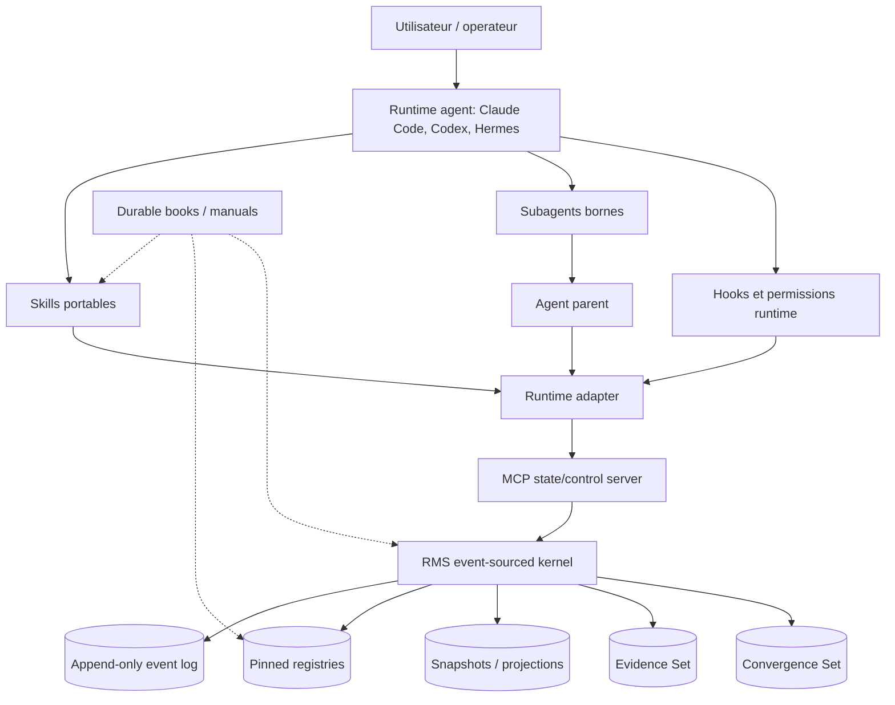

La pile d'autorite fermee en Cycle 04 est stricte:

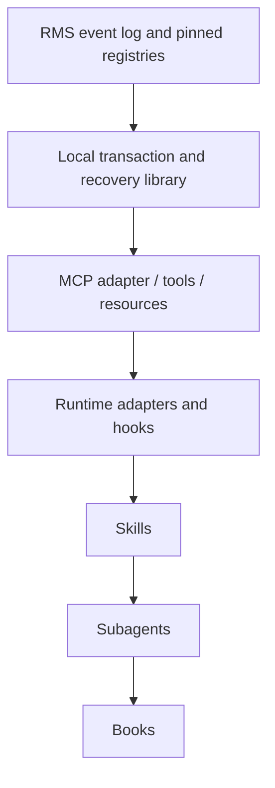

Implication operationnelle:

- les snapshots sont des projections;
- MCP est le transport portable, pas une seconde source de verite;
- les hooks prouvent l'enforceability runtime, pas la politique;
- les skills demandent des actions au noyau;
- les subagents produisent des paquets de preuve;
- les books expliquent et transmettent, sans ecraser les registries.

## 3. Separation Des Responsabilites

| Surface | Role | Autorite d'etat | Mutations autorisees |
|---|---|---:|---|
| RMS kernel | Source de verite, guards, evidence, convergence, final state | Oui | Ecriture event log, snapshots/projections, final close |
| MCP server | Interface portable state/control | Non, transport du kernel | Appelle les fonctions kernel |
| Local transaction library | Fallback de mutation `.rms/` quand MCP est indisponible | Non, execute les regles kernel | Mutations locales tracees et recuperables |
| Runtime adapter | Traduit capabilities, hooks, permissions, sandbox | Non | Rapporte Capability/Binding facts |
| Hooks runtime | Preuve d'enforcement pre/post/stop selon provider | Non | Bloque ou observe si le runtime le permet |
| Skills | Procedures reutilisables et UX | Non | Demandent transitions/evidence via kernel |
| Subagents | Lanes bornees de travail ou revue | Non | Produisent EvidencePacket candidat |
| Books | Documentation durable et playbooks | Non | Aucune mutation d'etat |

La regle centrale est que tout objet qui peut etre contredit par l'event log
est derive. Une projection, un book, une sortie de skill ou un verdict subagent
ne devient utilisable qu'apres intake par le kernel.

## 4. Objets D'Etat Canonique

L'etat courant est compose de trois couches:

```text
RunState =
  RunEnvelope
  + HarnessMachineState | NOT_ACTIVE
  + DerivedView
```

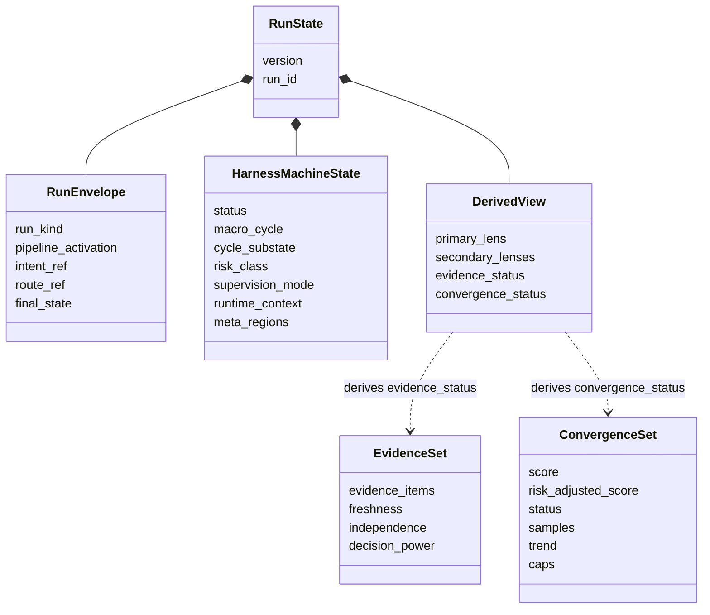

Les lenses fractales (`OBSERVE`, `DEFINE`, `DESIGN`, `EXECUTE`, `VERIFY`,
`CAPITALIZE`, `TRANSMIT`) ne sont pas des etats sources. Elles sont derivees du
`cycle_substate` par registry.

Regles invariantes majeures:

- `pipeline_activation=inactive` implique `harness_machine.status=NOT_ACTIVE`;
- `macro_cycle=IDLE` n'est valide que si la machine est armee ou active mais
  entre deux cycles;
- un vrai `macro_cycle` exige un `cycle_substate` appartenant au cycle;
- `risk_class=UNCLASSIFIED` interdit `bypass`;
- `risk_class=E` ou `C` interdit `bypass`;
- `risk_class=C` interdit `auto_decision` sans checkpoint humain obligatoire;
- `DONE_VERIFIED` exige evidence `verified` et convergence `verified`;
- toute transition d'etat gouvernee produit un evenement append-only.

## 5. Activation Et Cycle Macro

L'activation de pipeline est separee des cycles et du mode de supervision.

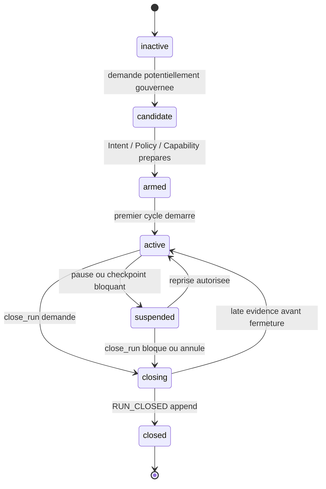

Les macro-cycles forment un flux nominal, avec retours de validation et
recadrage quand les guards ou la convergence l'exigent.

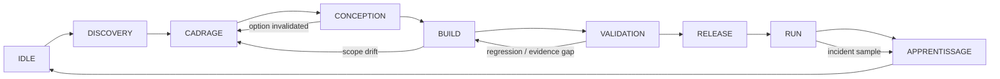

Les substates sont semantiques. Exemples:

| Macro-cycle | Substates typiques | Lens derivee |
|---|---|---|
| DISCOVERY | `discovery.problem_frame` | OBSERVE / DEFINE |
| CADRAGE | `cadrage.scope_boundary` | DEFINE |
| CONCEPTION | `conception.option_space` | DESIGN |
| BUILD | `build.implementation_slice` | EXECUTE |
| VALIDATION | `validation.acceptance_check` | VERIFY |
| RELEASE | `release.rollback_ready` | TRANSMIT |
| RUN | `run.incident_triage` | OBSERVE / VERIFY |
| APPRENTISSAGE | `learning.pattern_extraction` | CAPITALIZE |

## 6. Flux Micro D'Un Run

Un run gouverne suit une sequence minimale. Les details peuvent boucler, mais
la source de verite reste l'event log.

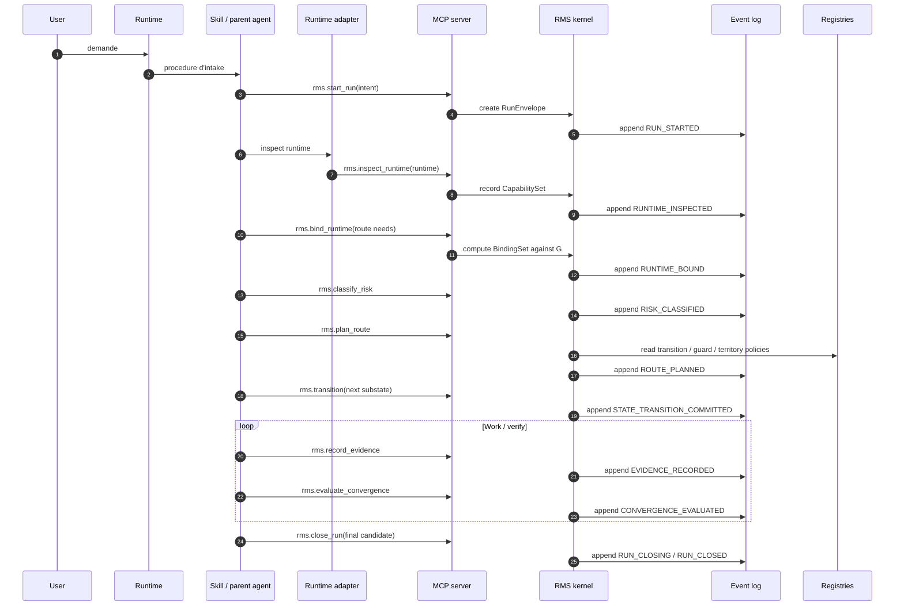

Tout changement de route, de risque, de runtime binding, de scope, de policy ou
de final state invalide les evaluations qui dependent d'une version precedente.

## 7. MCP Comme Interface Unique

Le MCP server expose le noyau en outils et ressources portables.

Outils conceptuels:

| Tool | Fonction |
|---|---|
| `rms.start_run` | Cree le run et l'enveloppe initiale. |
| `rms.inspect_runtime` | Produit un CapabilitySet frais. |
| `rms.bind_runtime` | Lie les gates abstraites a des primitives runtime. |
| `rms.classify_risk` | Assigne ou promeut T/F/M/E/C. |
| `rms.plan_route` | Produit la Route Set candidate. |
| `rms.transition` | Demande une transition semantique. |
| `rms.evaluate_guard` | Calcule allow/warn/block/escalate/degrade/reroute. |
| `rms.record_evidence` | Normalise une preuve dans l'Evidence Set. |
| `rms.evaluate_convergence` | Evalue score, caps, tendance et statut. |
| `rms.close_run` | Commit le final state selon transaction stricte. |

Ressources conceptuelles:

| Resource | Contenu |
|---|---|
| `rms://runs/{run_id}/state` | Etat compose courant. |
| `rms://runs/{run_id}/events` | Evenements append-only. |
| `rms://runs/{run_id}/evidence` | Evidence Set et evaluations. |
| `rms://runtime/capabilities/{runtime}` | CapabilitySet par runtime. |
| `rms://runtime/bindings/{runtime}` | BindingSet actif. |
| `rms://registry/guards` | Guards valides et versionnes. |
| `rms://registry/transitions` | Graphe de transitions. |

Le design garde un seul MCP state/control server externe parce qu'un guard doit
lire un etat coherent: state, policy, runtime capability, evidence,
convergence, territory et storage.

## 8. Guard Matrix

Une decision de guard est une composition deterministe d'overlays.

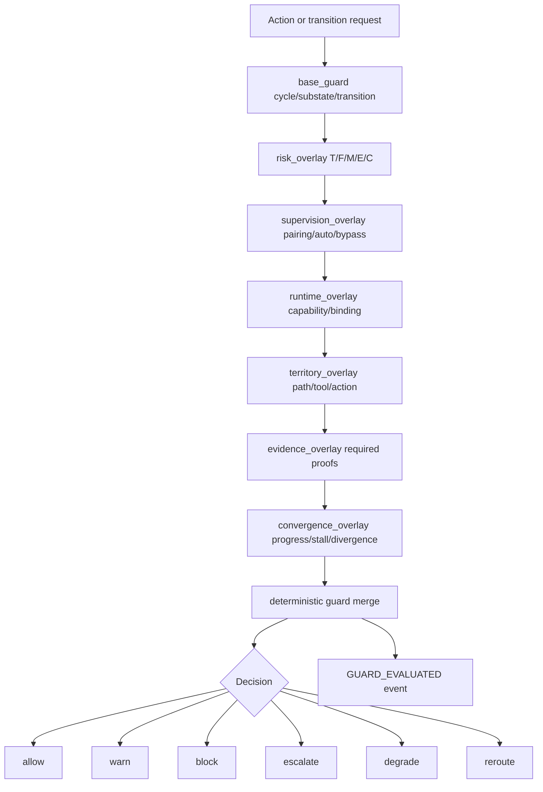

Une sortie de guard doit etre structuree:

```json
{
  "decision": "block",
  "gate": "territory_guard",
  "reason": "BUILD-only write attempted from discovery.problem_frame",
  "severity": "hard",
  "risk_class": "M",
  "required_action": "move to BUILD.implementation_slice",
  "evidence_required": ["state_transition_event", "blocked_tool_event"]
}
```

La granularite de risque change les obligations:

| Risque | Bypass | Checkpoint humain | Evidence |
|---|---|---|---|
| T | possible | non par defaut | minimale |
| F | conditionnel | non sauf warning | legere |
| M | bloque par defaut | ambiguite ou gate critique | standard |
| E | interdit | requis aux gates critiques | renforcee |
| C | interdit | requis | maximale + revue independante |

## 9. Territory Enforcement

Le territoire empeche qu'une procedure, un tool ou un subagent agisse hors du
scope declare. La regle de Cycle 04 est fail-closed.

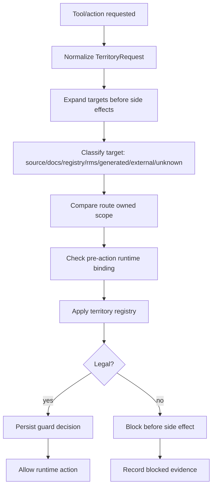

Defaults importants:

- chaque action gouvernee devient une `TerritoryRequest`;
- cible inconnue, expansion ambigue ou chemin hors scope bloquent par defaut;
- `.rms/registry/**` requiert un territoire de registry lock et au moins une
  classe de risque M;
- `.rms/runs/**` est kernel-owned et s'ecrit seulement via MCP ou transaction
  locale autorisee;
- l'audit-only runtime fallback ne suffit jamais pour des writes M/E/C.

## 10. Convergence

La convergence n'est pas un compteur d'iterations. Elle mesure si preuves,
risque et scope avancent vers une fermeture valide.

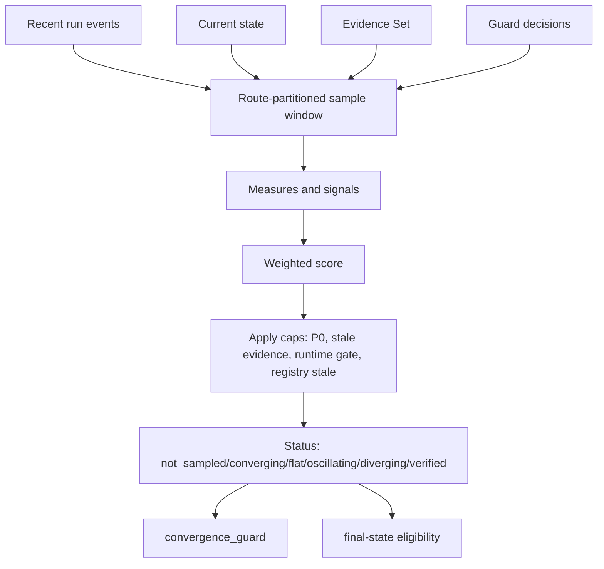

Le policy object conceptuel est:

```text
.rms/registry/policies/convergence-policy.yaml
```

Cycle 04 fixe notamment:

- des windows partitionnees par `run_id`, `route_version`, `macro_cycle` et
  `cycle_substate`;
- un minimum de samples pour statuts et verification;
- des poids dont le total doit faire `1.00`;
- des caps pour P0 non resolu, evidence stale/conflictuelle, runtime hard gate
  manquant, registry stale, pattern repete sans nouveau signal;
- `DONE_VERIFIED` exige convergence `verified`, evidence `verified`, score
  minimum de policy et aucune cap interdite.

Les loops sont detectees par patterns repetes et absence de signal nouveau.
Une iteration supplementaire n'est saine que si elle declare une hypothese de
progres et un signal attendu mesurable.

## 11. Evidence

L'Evidence Set est la source de verite des preuves normalisees. Les logs
provider, sorties shell, verdicts subagents, approvals humains ou traces hooks
ne sont que des inputs jusqu'a normalisation.

Dimensions de qualite:

| Dimension | Question |
|---|---|
| Presence | La preuve requise existe-t-elle ? |
| Pertinence | Couvre-t-elle le risque et les criteres actifs ? |
| Fraicheur | Correspond-elle au dernier etat/route/policy ? |
| Independence | Vient-elle d'une source suffisamment distincte ? |
| Decision power | Permet-elle allow/warn/block/escalate ? |

Statuts derives:

```text
missing
partial
sufficient
with_gaps
verified
stale
conflicted
```

`DONE_VERIFIED` interdit tout statut autre que `verified`. `DONE_WITH_GAPS`
peut accepter des gaps explicites, possedes et non critiques selon policy.

## 12. Close Run

La fermeture est la transaction la plus dense. Elle compose evidence,
convergence, runtime, territory, human checkpoint, registry freshness et
storage integrity.

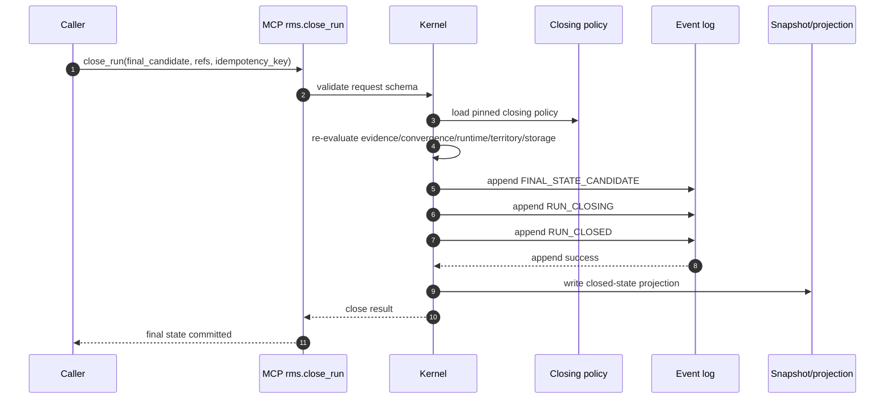

Regles:

- `rms.close_run` est le seul outil qui commit `final_state`;
- event append doit preceder projection;
- si append echoue, aucun final state n'est mute;
- un etat ferme protege les champs de cloture;
- une preuve tardive apres fermeture devient audit ou correction candidate;
- reopen signifie nouveau run ou correction overlay, jamais rewrite in-place du
  `RUN_CLOSED`.

Final states:

| Final state | Sens |
|---|---|
| `DONE_VERIFIED` | Succes complet, evidence et convergence verified. |
| `DONE_WITH_GAPS` | Succes avec gaps acceptes par policy. |
| `BLOCKED_NEEDS_USER` | Decision humaine exacte requise. |
| `BLOCKED_RUNTIME_MISSING` | Capability/binding requis absent, stale ou interdit. |
| `BLOCKED_POLICY` | Policy ou registry bloque l'action. |
| `MAX_ATTEMPTS_REACHED` | Fuse atteint avec hypotheses distinctes tracees. |
| `LOOP_DETECTED` | Pattern repete sans progres nouveau. |
| `CANCELLED` | Annulation tracee. |
| `ABORTED` | Arret non nominal avec raison et frontiere d'integrite. |

## 13. Storage Et Recovery

Le stockage attendu est append-only avec projections regenerables.

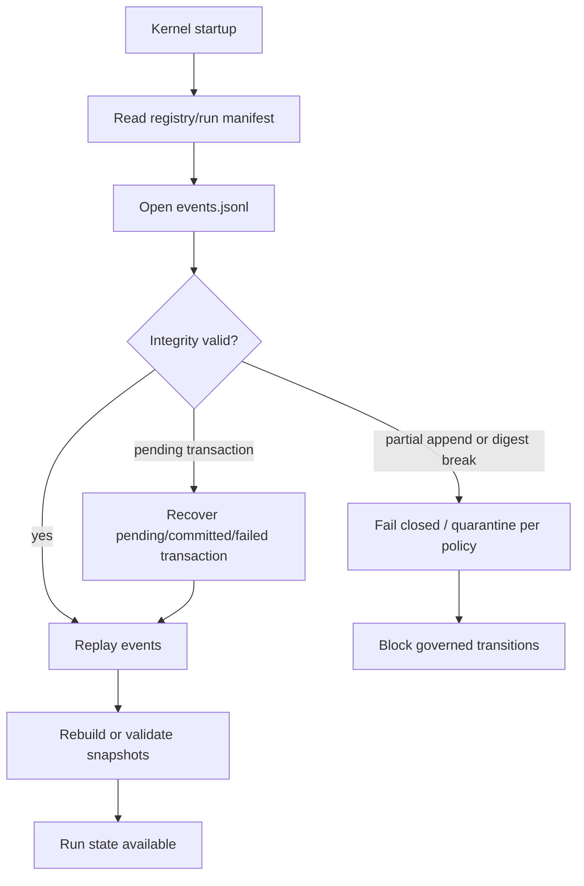

Principes:

- l'event log gagne sur le snapshot;
- une transaction pending bloque les transitions gouvernees tant que la
  recuperation n'a pas abouti;
- la recovery automatique ne doit pas reediter l'histoire commitee;
- les corruptions qui ne peuvent pas etre rejouees proprement bloquent plutot
  que de produire un etat magique;
- operator/admin repair est une voie separee des garanties schema-first.

Layout conceptuel:

```text
.rms/
  registry/
    registry-manifest.yaml
    guards/
    policies/
    schemas/
  runs/
    <run_id>/
      events.jsonl
      manifest.json
      snapshots/
      evidence/
      convergence/
      decisions/
      transactions/
        pending/
        committed/
        failed/
```

## 14. Registries, Configuration Et Observability

Les registries sont la configuration executable. Les books peuvent expliquer un
contrat, mais le kernel lit les registries et leurs digests.

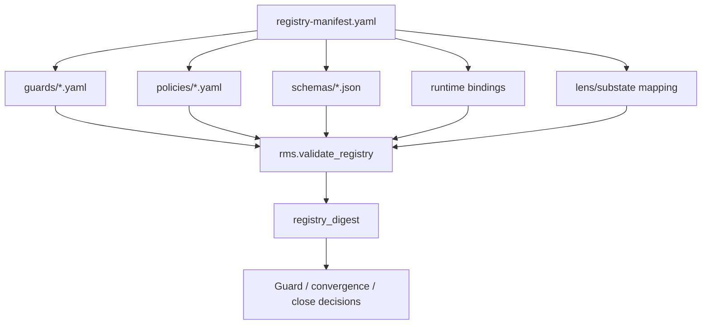

Registries attendus:

| Registry | Role |
|---|---|
| `registry-manifest.yaml` | Liste les fichiers autoritaires et leurs digests. |
| `guards/*.yaml` | Base guards et overlays. |
| `guards/territory-overlays.yaml` | Regles path/tool/action. |
| `policies/convergence-policy.yaml` | Windows, weights, caps, statuts et final-state effects. |
| `policies/closing-policy.yaml` | Eligibilite final state, late evidence, reopen/correction. |
| `schemas/*.json` | Validation des events, requests, evaluations et policies. |
| `runtime/bindings/*.yaml` | Mapping gates abstraites vers provider/runtime. |
| `state/*.yaml` | Final states, substates, lenses, transitions. |

Un changement de registry produit un nouveau digest. Les evaluations
dependantes deviennent stale tant qu'elles ne sont pas recomputees contre la
version courante.

Observability:

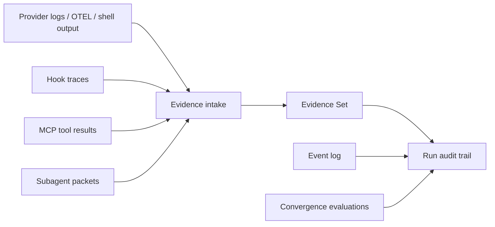

Le log provider brut n'est pas la preuve finale. Il peut alimenter l'Evidence
Set si son origine, sa fraicheur et son lien avec la route courante sont
tracables. L'audit trail canonique est la combinaison:

- event log append-only;
- guard decisions;
- evidence evaluations;
- convergence evaluations;
- runtime CapabilitySet/BindingSet;
- close decisions et final record.

Metriques utiles au-dessus du noyau:

| Metrique | Source canonique |
|---|---|
| Duree de run | Events `RUN_STARTED`, `RUN_CLOSED` ou blocked final event. |
| Nombre de transitions | Event log. |
| Nombre de guards block/warn/degrade | Guard decision records. |
| Fraicheur evidence | EvidenceEvaluation. |
| Score convergence | ConvergenceEvaluation. |
| Runtime degradation count | BindingSet + guard/runtime decisions. |
| Tokens/cout provider | Logs provider normalises en EvidenceItem si disponibles. |

## 15. Runtime Portability

Le systeme central ne compile pas directement une action vers "Claude",
"Codex" ou "Hermes". Il compile vers des gates abstraites, puis l'adapter
runtime prouve un binding.

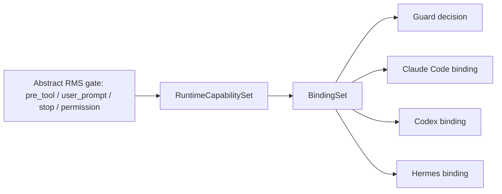

Le mapping provider consolide indique que:

| Primitive | Point commun portable | Difference a garder |
|---|---|---|
| Instructions persistantes | Tous ont un ou plusieurs fichiers projet/utilisateur | Noms, hierarchie, imports et limites different |
| Skills | `SKILL.md` est le point d'ancrage le plus portable | Scopes, metadata, auto-invocation et distribution divergent |
| Hooks | Tous ont une surface de lifecycle ou plugin/hook | Evenements, blocage, injection et feature flags divergent |
| Subagents | Delegation isolee existe dans les trois | Contexte, durabilite, concurrence et recursion divergent |
| MCP | Standard commun le plus stable | Transports, auth, filters, resources/prompts varient |
| Permissions/sandbox | Tous gouvernent permissions et execution | Les modeles ne sont pas isomorphes |

Capability flags a porter:

```text
can_block
can_modify_input
can_inject_context
can_call_http
can_call_mcp_tool
can_spawn_agent
requires_feature_flag
binding_status = native | fallback | noop_traced | missing
fallback_strategy
fail_open_risk
```

Regle de verification:

```text
No fresh hook capability proof
= no governed M/E/C mutation
= no DONE_VERIFIED
```

## 16. Hooks-First Boundary

Le Cycle 04 ferme le noyau, pas l'enforcement runtime. La phase hooks-first
precise:

- les gates canoniques (`user_prompt`, `pre_tool`, `stop`, `subagent_stop`,
  etc.);
- les champs de CapabilitySet et BindingSet;
- les probes de fraicheur;
- l'expansion de targets avant side effects;
- la matrice concrete Claude/Codex/Hermes;
- les fixtures qui prouvent qu'un hook bloque vraiment au niveau requis.

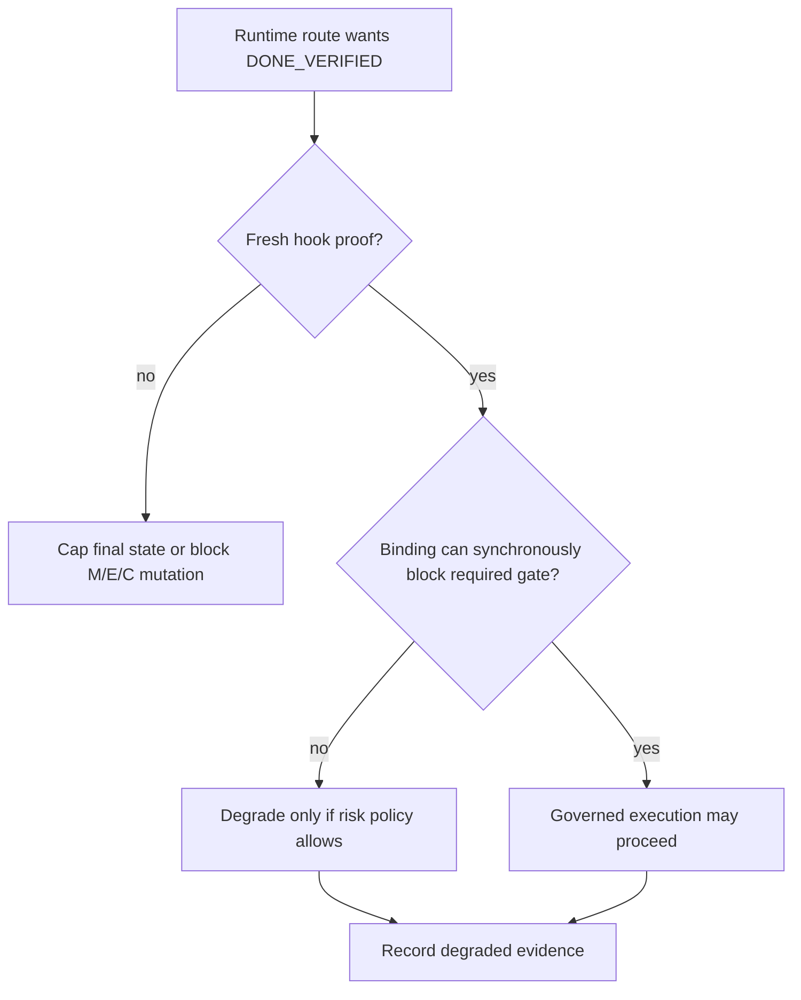

Runtime implementation reste bloquee tant que les specs hooks-first, schemas et
fixtures ne sont pas acceptes.

## 17. Skills, Subagents Et Books

Ces trois surfaces sont utiles mais volontairement subordonnees.

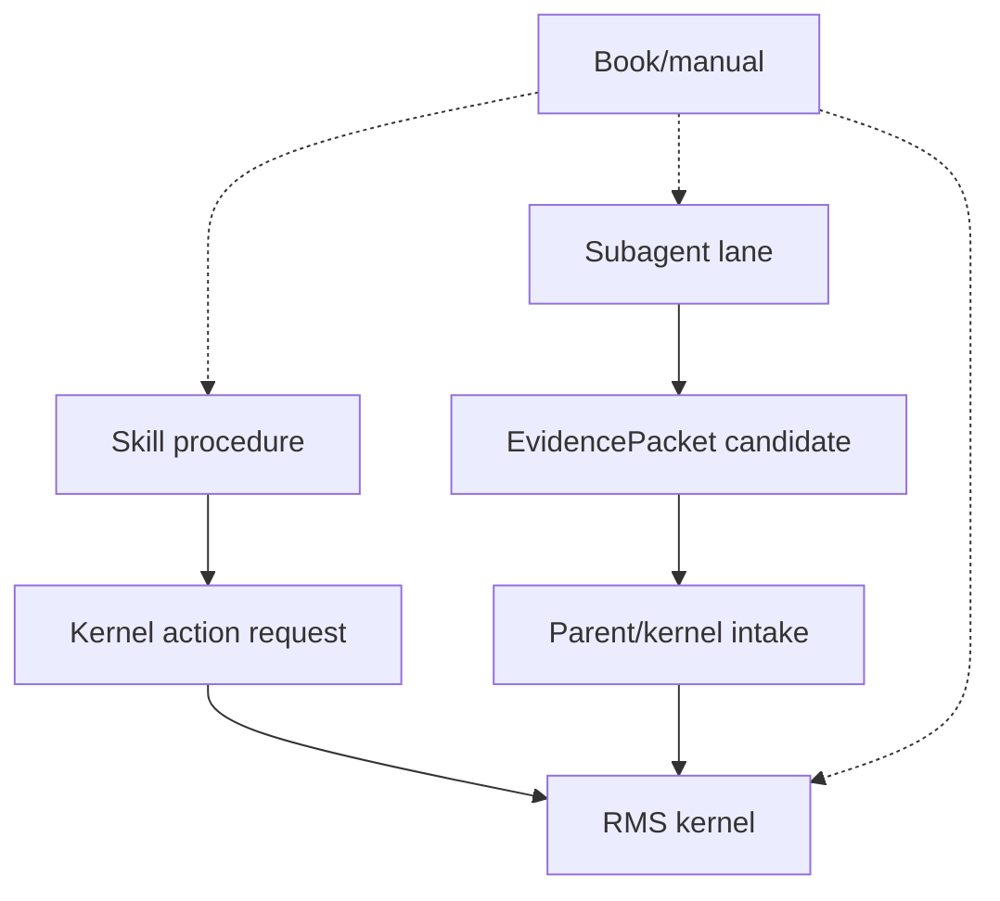

MVP skills proposes:

| Skill | Role |
|---|---|
| `pfv4-intake` | Capturer l'intention et recommander inactive/candidate/armed. |
| `pfv4-risk-classify` | Classer ou promouvoir T/F/M/E/C. |
| `pfv4-runtime-probe` | Detecter capabilities, bindings et degradation. |
| `pfv4-route` | Construire une Route Set candidate. |
| `pfv4-transition` | Demander une transition semantique. |
| `pfv4-evidence` | Normaliser les sorties en Evidence Set. |
| `pfv4-stop-gate` | Evaluer la cloture candidate. |
| `pfv4-loop-recover` | Diagnostiquer stagnation, oscillation et divergence. |

MVP subagents proposes:

| Subagent | Role |
|---|---|
| `risk-policy-reviewer` | Revoir risque, bypass et mode de supervision. |
| `route-architect` | Challenger la Route Set. |
| `evidence-auditor` | Verifier fraicheur, pertinence, independence et decision power. |
| `convergence-critic` | Detecter flat/oscillating/diverging loops. |
| `runtime-binding-inspector` | Verifier gates runtime, MCP et hook capabilities. |
| `state-invariant-reviewer` | Verifier no-null, substates et invariants de transition. |

Books MVP:

| Book | Role |
|---|---|
| State Kernel Book | Etat canonique, no-null, activation, final states. |
| Cycle Playbooks Book | Macro-cycles, substates, handoffs et rework. |
| Risk And Policy Book | Risque T/F/M/E/C, bypass, checkpoints. |
| Evidence And Convergence Book | Preuves, fraicheur, convergence, loop recovery. |
| Runtime Bindings Book | Semantique Claude/Codex/Hermes. |
| MCP And Tools Book | Frontieres MCP/tools, secrets, fallback. |

## 18. Failure Modes Principaux

| Situation | Traitement attendu |
|---|---|
| Capability runtime inconnue | Bloquer jusqu'a `rms.inspect_runtime`. |
| Hook requis absent sans fallback | Bloquer; pour M/E/C pas de downgrade silencieux. |
| Hook audit-only pour write gouverne M/E/C | Bloquer ou reroute. |
| Evidence stale apres route change | Recalculer; pas d'autorisation final-state. |
| Evidence conflictuelle | Cap convergence ou block selon policy. |
| Scope grossit sans owner | Cap convergence, reroute ou recadrage. |
| Action hors territoire | Block pre-side-effect et event de guard. |
| Transaction pending | Recuperer avant toute transition gouvernee. |
| Append final state echoue | Aucun final state mute. |
| Late evidence apres closure | Audit/correction candidate, pas rewrite. |
| Pattern repete sans nouvelle hypothese | `LOOP_DETECTED` ou reroute. |
| Checkpoint humain requis absent | `BLOCKED_NEEDS_USER`. |

## 19. Objets A Produire En Schema-First

Le prochain package de planification doit transformer la prose en artefacts
validables:

```text
docs/propositions/pipeline-fractal-v4-implementation-plan/
  00-schema-first-brief.md
  01-registry-and-schema-inventory.md
  02-fixture-matrix.md
  03-kernel-module-boundaries.md
  04-mcp-tool-slice-plan.md
  05-runtime-adapter-slice-plan.md
  06-skill-subagent-book-bootstrap.md
  07-implementation-risk-register.md
```

Inventaire minimal d'objets:

| Famille | Artefacts |
|---|---|
| State | RunEnvelope, HarnessMachineState, DerivedView, RunManifest |
| Registry | transitions, substates, lenses, guards, overlays, policies |
| Runtime | CapabilitySet, BindingSet, adapter matrix, hook probe result |
| Territory | TerritoryRequest, target classes, ownership rules |
| Evidence | EvidenceItem, EvidenceEvaluation, freshness graph |
| Convergence | ConvergenceSample, policy, evaluation, caps |
| Storage | Event, transaction, replay result, integrity state |
| Closing | CloseRunRequest, CloseRunResult, final record, correction overlay |
| MCP | Tool envelopes, resource envelopes, error envelopes |
| Artifacts | Skill manifest, subagent evidence packet, book manifest |

## 20. Lecture Des Sources Locales

Sources directes de cette synthese:

| Source | Role |
|---|---|
| `06-integrated-final-proposal.md` | Candidate C, separation RMS/MCP/runtime/skills/subagents/books. |
| `cycle-04/06-cycle-04-integration.md` | Statut PASS, autorite finale, handoff schema-first, obligations restantes. |
| `../pipeline-fractal-v4-state-machine/01-state-model.md` | RunState, activation, cycles, lenses, final states, invariants. |
| `../pipeline-fractal-v4-state-machine/04-guard-matrix.md` | GuardDecision et overlays. |
| `../pipeline-fractal-v4-state-machine/05-convergence-model.md` | Semantique evidence/convergence/loop. |
| `cycle-04/01-convergence-policy-thresholds.md` | Policy convergence, weights, caps, thresholds, fixtures. |
| `cycle-04/02-territory-enforcement-contract.md` | Territory registry, request, target expansion, fail-closed. |
| `cycle-04/03-storage-recovery-contract.md` | Integrity, replay, pending transactions, recovery. |
| `cycle-04/04-closing-transaction-reopen.md` | `rms.close_run`, closing policy, late evidence, reopen/correction. |
| `../pipeline-fractal-v4-specs/README.md` | Hooks-first correction and runtime implementation gate. |
| `../provider-portability-mapping-convergence-v2.md` | Mapping Claude Code / Codex / Hermes et primitives portables. |

## 21. Cycle De Convergence De Cette Documentation

Cette synthese a ete structuree en quatre passes:

1. Source inventory: alignement sur Cycle 04, state-machine V2, specs
   hooks-first et mapping provider.
2. Macro synthesis: bloc RMS/MCP/runtime/skills/subagents/books et pile
   d'autorite.
3. Micro synthesis: objets, transitions, guards, territory, convergence,
   evidence, close transaction et recovery.
4. Self-check: verification que la doc expose statut, autorite, flux nominal,
   flux de blocage, runtime portability, limites et prochaine phase.

Definition de done documentaire:

- le lecteur peut reconstruire la topologie generale sans ouvrir les autres
  fichiers;
- les Mermaid diagrams couvrent macro topology, authority, state, run flow,
  guard merge, territory, convergence, close, recovery et hook boundary;
- chaque surface dit explicitement si elle est autoritaire ou derivee;
- les limites d'implementation sont visibles et non masquees.
