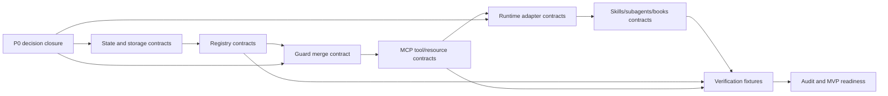

# 02 - Planning Implementation Roadmap

Status: Cycle 02 planning lane

## Purpose

This roadmap turns the Cycle 01 final proposal into an implementation-shaped
path to MVP. It does not implement the RMS kernel, MCP server, skills,
subagents, books, adapters, or registries. It defines the order in which those
contracts must become executable enough for an implementer to build without
choosing architecture policy ad hoc.

Cycle 02 planning assumes the Cycle 01 architecture direction:

```text
Hybrid event-sourced RMS kernel
+ one MCP state/control server
+ runtime adapters/hooks
+ skills as procedures
+ subagents as bounded evidence/review lanes
+ books as durable knowledge
```

## Operating Loop

Every MVP phase must use the same loop:

```text
Discovery -> Planning -> Contract Design -> Verify -> Audit -> Integration
```

| Stage | Implementation-planning meaning | Required output |
|---|---|---|
| Discovery | Read current proposal, state-machine V2, open decisions, edge cases, and any previous phase artifact. | Source snapshot and gap list. |
| Planning | Pick the next smallest implementation slice and its dependencies. | Phase plan with acceptance criteria. |
| Contract Design | Define schemas, tool contracts, registry records, fixtures, or book/subagent interfaces. | Contract artifact, not runtime code. |
| Verify | Convert the contract into fixtures, invariants, or review checks. | Expected pass/fail cases. |
| Audit | Red-team fail-open, drift, stale evidence, authority overlap, and runtime degradation. | Blocker list or accepted residual gaps. |
| Integration | Update the MVP contract boundary and next-phase dependencies. | Integration note and updated P0 status. |

The loop is valid only when it reduces ambiguity. A phase that adds prose but no
schema, fixture, acceptance criterion, or closed decision is not converging.

## MVP Goal

The MVP proves one claim:

```text
The RMS kernel can govern a local run through state transitions, guard
evaluation, evidence capture, convergence sampling, runtime degradation handling,
and final-state closure without letting skills, subagents, books, hooks, or MCP
clients become independent authorities.
```

## Dependency Graph



## Phase 0 - Decision Lock Before MVP Contracts

Objective: close or assign implementation defaults for every P0 decision that
blocks executable state-machine work.

### P0 Decisions To Close

| Decision | MVP default | Implementation object | Blocks |
|---|---|---|---|
| Substate cardinality | Variable semantic substates, each mapped to one primary lens. | `substates` registry schema. | State schema, transition validation. |
| Transition topology | Explicit directed graph with named rework edges. | `transitions` registry schema. | Guard evaluation, loop detection. |
| Non-development representation | Inactive runs may use derived lens only; artifacts are `candidate_evidence` until imported. | Run schema and evidence import rule. | Activation, evidence status. |
| Activation gate | `candidate -> armed` requires Intent, Policy, Capability, Binding, Route, and risk decision or explicit `UNKNOWN` where allowed. | Activation transition contract. | `rms.start_run`, `rms.plan_route`, `rms.transition`. |
| Risk/supervision matrix | `T` bypass allowed, `F` conditional, `M` blocked by default, `E/C` forbidden; `C` requires human-visible checkpoint/pairing. | Risk and mode overlays. | Guard merge, route planning. |
| Risk classifier mechanics | Agent proposes; forcing signals set minima; human/reviewer validates when required. | `rms.classify_risk` contract and fixtures. | Route planning, write gates. |
| Evidence semantics | Evidence status derived from Evidence Set, not manually declared. | Evidence requirement schema. | Stop gate, final states. |
| Convergence thresholds | Score and sample windows by risk, with max attempts as fuse only. | Convergence contract and fixtures. | Loop recovery, final closure. |
| Territory enforcement | Registry source of truth; runtime hooks when native; post-run audit only when risk policy permits. | Territory overlay and runtime binding schema. | Writes, degraded route policy. |
| Closing protocol | Enter `closing` with final candidate; commit only after evidence, convergence, policy, runtime, and blocker checks pass. | `rms.close_run` contract. | `DONE_VERIFIED`, `DONE_WITH_GAPS`, blocked states. |

### Acceptance Criteria

- Each P0 has a default, owner artifact, and fixture expectation.
- No P0 remains as a free implementer choice.
- Any unresolved P0 is marked as MVP blocker, not deferred silently.

### Artifacts

- P0 decision table in Cycle 02 integration.
- ADR/supersession note deciding whether V2/final proposal supersedes
  `docs/conception/01-state-machine-spec.md`.

## Phase 1 - Kernel State And Storage Contract

Objective: define the local event-sourced state substrate before MCP tools or
skills exist.

### Contract Scope

- `RunEnvelope`.
- `HarnessMachineState`.
- `DerivedView`.
- Event envelope.
- Run Set projection.
- Evidence Set.
- Convergence Set.
- Runtime Capability Set.
- Runtime Binding Set.
- Registry Set references.
- Local `.rms/` layout and lock/transaction behavior.

### Recommended MVP Storage Shape

```text
.rms/
  registry/
    schemas/
    substates.yaml
    transitions.yaml
    guards.yaml
    policies.yaml
    evidence-requirements.yaml
    runtime-bindings/
  runs/
    {run_id}/
      events.jsonl
      snapshot.json
      intent.json
      route.json
      evidence.json
      convergence.json
      guard-decisions.jsonl
      locks/
```

The event log is authoritative. Snapshots and derived views are projections.
If an event cannot be appended, the mutation fails.

### Acceptance Criteria

- No executable state field uses `null`; unknown and not-applicable values use
  explicit tokens.
- `primary_lens`, evidence status, and convergence status are derived or
  projection fields, never independently editable authorities.
- Every change to activation, macro-cycle, substate, risk, supervision mode,
  runtime binding, evidence status, convergence verdict, or final state has an
  append-only event.
- Closed runs are immutable except append-only audit records or explicit reopen
  proposals.

### Artifacts

- `.rms/` storage layout proposal.
- JSON schema list for kernel-owned sets.
- Event type catalog with required fields.
- Projection rules from event log to snapshot.

## Phase 2 - Registry And Policy Contract

Objective: convert V2 prose into versioned declarative registries that can be
validated before runtime use.

### Registry Split

| Registry | Purpose |
|---|---|
| `substates` | Macro-cycle-specific semantic substates and primary lens mapping. |
| `transitions` | Directed graph of activation, internal, macro, rework, risk, meta-region, and final-state transitions. |
| `guards` | Base guard definitions and required evaluation inputs. |
| `risk-overlays` | T/F/M/E/C evidence depth, bypass, checkpoint, rollback, and review rules. |
| `mode-overlays` | Pairing, auto-decision, and bypass constraints. |
| `runtime-overlays` | Required gates, binding statuses, fail-open rules, and fallback policy. |
| `territory-overlays` | Path/tool/action permissions by cycle, substate, route, and risk. |
| `evidence-requirements` | Required proofs by cycle, transition, final candidate, and risk. |
| `convergence-rules` | Progress signals, sample windows, score caps, loop and divergence thresholds. |
| `final-state-rules` | Conditions for `DONE_VERIFIED`, `DONE_WITH_GAPS`, and blocked states. |

### Acceptance Criteria

- Registries use English ASCII identifiers for executable values.
- French labels may exist only as display aliases or migration metadata.
- A validator can reject unknown substates, generic `Cycle.Observer`-style
  stored states, invalid lens mappings, invalid transition edges, and missing
  evidence requirements.
- Books can render registry explanations but cannot weaken registry rules.

### Artifacts

- Registry file split.
- Minimal schema per registry.
- Registry validation checklist.
- Book/registry conflict fixture.

## Phase 3 - Guard Merge And Decision Contract

Objective: define a deterministic guard merge algorithm before writing any
kernel transition code.

### Merge Inputs

```text
base_guard(cycle, substate, transition)
+ risk_overlay(T/F/M/E/C)
+ supervision_overlay(pairing/auto_decision/bypass)
+ runtime_overlay(capabilities/bindings)
+ territory_overlay(path/tool/action)
+ evidence_overlay(required proofs)
+ convergence_overlay(progress/stall/divergence)
```

### Required Algorithm Decisions

- Precedence between `block`, `escalate`, `reroute`, `degrade`, `warn`, and
  `allow`.
- Whether `degrade` is a terminal guard decision or an annotated `warn/block`
  decision with fallback metadata.
- How conflicting overlays produce a single decision.
- How required actions and required evidence are merged without loss.
- How guard decisions map to final-state candidates.
- How stale, missing, or conflicted inputs affect the decision.

### Recommended MVP Rule

Use fail-closed severity precedence:

```text
block > escalate > reroute > degrade > warn > allow
```

Then apply policy caps:

- `capability_unknown` blocks until discovery.
- `missing` enforcement with no declared fallback blocks.
- `M+` cannot silently downgrade required enforcement.
- `E/C` runtime fail-open defaults to `BLOCKED_RUNTIME_MISSING`.
- evidence `conflicted` or `stale` blocks `DONE_VERIFIED`.
- `C` cannot use bypass and cannot close without human-visible checkpoint and
  independent review evidence.

### Acceptance Criteria

- The same inputs and registry version always produce the same decision.
- A blocked transition emits blocking evidence instead of disappearing.
- All decisions include reason, severity, gate, required action, required
  evidence, runtime binding metadata, and registry version.
- The merge contract can be tested without MCP transport.

### Artifacts

- Guard merge pseudo-code.
- Decision output schema.
- Conflict-resolution table.
- Guard merge fixtures for mixed `block/warn/degrade/reroute/escalate` inputs.

## Phase 4 - MCP Tool And Resource Contract

Objective: expose the kernel through one MCP server without making MCP the only
possible local access path.

### MVP Tool Set

| Tool | Contract purpose |
|---|---|
| `rms.start_run` | Create run id, Intent Set, initial event, and inactive/candidate/armed state. |
| `rms.inspect_runtime` | Produce Runtime Capability Set. |
| `rms.bind_runtime` | Resolve Runtime Binding Set from capability and policy. |
| `rms.classify_risk` | Assign/promote risk using forcing signals and policy. |
| `rms.plan_route` | Build Route Set from Intent, Policy, Capability, Binding, and risk. |
| `rms.evaluate_guard` | Return deterministic guard decision without committing. |
| `rms.transition` | Evaluate guards and commit allowed transition with event append. |
| `rms.record_evidence` | Append validated Evidence Set item. |
| `rms.evaluate_evidence` | Derive evidence status, gaps, stale/conflict flags. |
| `rms.evaluate_convergence` | Sample progress and derive convergence status. |
| `rms.close_run` | Move active/suspended to closing/closed only through stop gates. |
| `rms.get_state` | Return canonical snapshot and derived view. |
| `rms.get_events` | Return event stream slice. |
| `rms.validate_registry` | Validate registries and merged derived views. |
| `rms.check_territory` | Evaluate path/tool/action permission. |
| `rms.check_runtime_binding` | Evaluate native/fallback/noop/missing enforceability. |

### Resource Set

Expose read-only resources for run state, events, intent, route, evidence,
convergence, runtime capabilities, runtime bindings, and merged registries.
Mutations always go through tools.

### Acceptance Criteria

- All mutating tools append events before returning success.
- All mutating tools fail if event append fails.
- Tool failures return typed errors, not prose-only explanations.
- MCP outage fallback is limited to declared local kernel/file transaction mode;
  no governed transition can be claimed verified without guard/evidence
  evaluation.
- Tool contracts are expressible as JSON schemas and acceptance fixtures.

### Artifacts

- MCP tool input/output/error schemas.
- MCP resource URI catalog.
- Transaction/fallback rule.
- MCP outage fixture.

## Phase 5 - Runtime Adapter And Binding Contract

Objective: make runtime capability and degradation explicit before relying on
hooks, shell tools, subagents, or stop gates.

### Adapter Responsibilities

- Discover runtime facts.
- Report hook availability and whether hooks can block synchronously.
- Report MCP availability.
- Report subagent support and limits.
- Report skill install/source facts.
- Report filesystem/tool permission model.
- Map abstract RMS gates to runtime primitives.
- Record degraded/no-op/fallback bindings.

Adapters do not own policy semantics and do not write around the kernel.

### Acceptance Criteria

- Runtime name alone never implies enforceability.
- Required gate metadata includes `required_gate`, `binding_status`,
  `can_block`, `fallback_strategy`, `fail_open_risk`, and `trace_event`.
- T/F may continue with traced degradation only when policy permits and final
  state cannot be `DONE_VERIFIED` if required evidence is missing.
- M requires native enforcement or exhaustive declared compensation.
- E/C missing hard gates default to `BLOCKED_RUNTIME_MISSING`.

### Artifacts

- Codex binding contract first.
- Claude and Hermes binding stubs.
- Runtime degradation policy table.
- Capability discovery fixture.

## Phase 6 - Skills, Subagents, And Books Contract

Objective: define portable procedures, bounded workers, and durable manuals
without letting them become state authorities.

### MVP Skills

- `pfv4-intake`
- `pfv4-risk-classify`
- `pfv4-runtime-probe`
- `pfv4-route`
- `pfv4-transition`
- `pfv4-evidence`
- `pfv4-stop-gate`
- `pfv4-loop-recover`

### MVP Subagents

- `risk-policy-reviewer`
- `route-architect`
- `evidence-auditor`
- `convergence-critic`
- `runtime-binding-inspector`
- `state-invariant-reviewer`

### MVP Books

- State Kernel Book.
- Cycle Playbooks Book.
- Risk And Policy Book.
- Evidence And Convergence Book.
- Runtime Bindings Book.
- MCP And Tools Book.

### Acceptance Criteria

- Skills may request transitions and record evidence only through kernel APIs.
- Subagents receive frozen state snapshots and return evidence candidates; they
  never mutate `.rms/`.
- Books are generated from or reconciled with registries where possible; prose
  conflicts never override executable rules.
- Skill drift blocks auto-invocation for core skills.
- Subagent disagreement marks evidence conflicted until arbitration.

### Artifacts

- Skill interface templates.
- Subagent input/output schema.
- Book authority notes.
- Drift and disagreement fixtures.

## Phase 7 - Verification Fixture Pack

Objective: make the MVP contract testable before implementation.

### Minimum Fixtures

| Fixture | Expected verdict |
|---|---|
| Skill attempts direct final-state mutation. | Blocked; must request kernel transition. |
| Subagent returns recommendation without evidence packet. | Rejected or marked non-decisive. |
| Book conflicts with guard registry. | Registry wins; book update/audit record required. |
| `DONE_VERIFIED` with partial evidence. | Blocked. |
| `DONE_WITH_GAPS` with unresolved E/C gap. | Blocked. |
| Codex lacks required blocking hook for M+ with no fallback. | `BLOCKED_RUNTIME_MISSING`. |
| T/F runtime degradation has declared post-run audit fallback. | Warn/degrade; not `DONE_VERIFIED` until evidence is sufficient. |
| Inactive architecture artifact used as authoritative Build evidence. | Blocked until imported as evidence through active transition. |
| Build/validation rework repeats same failing fix without new hypothesis. | `LOOP_DETECTED` or reroute/checkpoint. |
| Critical risk enters bypass mode. | Blocked and risk policy evidence recorded. |
| Stale test evidence predates latest diff. | Blocks `DONE_VERIFIED`. |
| Closed run receives late CI failure. | Append audit only; no silent final-state mutation. |

### Acceptance Criteria

- Fixtures cover state authority, guard authority, evidence stop gate,
  convergence loop control, runtime degradation, subagent evidence, book drift,
  and non-development run import.
- Every fixture names required input state, event/evidence setup, expected guard
  decision, and expected final-state eligibility.
- Fixture pack is sufficient to seed unit, integration, and contract tests.

### Artifacts

- Fixture matrix.
- Expected pass/fail verdicts.
- Mapping from edge cases to fixture IDs.

## Phase 8 - Audit And MVP Readiness Gate

Objective: decide whether implementation can start or whether Cycle 03 must
close remaining contract gaps.

### Audit Questions

- Is there exactly one state authority?
- Are event log, snapshot, and derived views conflict-resolved?
- Are guards executable and deterministic?
- Are runtime degradation rules fail-closed for M/E/C?
- Is `DONE_VERIFIED` impossible without fresh verified evidence and verified
  convergence?
- Are skills, subagents, and books prevented from becoming authorities?
- Are non-development artifacts prevented from becoming evidence without import?
- Is MCP outage behavior safe and typed?
- Are P0 decisions closed or explicitly blocking?

### Readiness Criteria

Implementation may start only when:

- all P0 decisions have implementation defaults;
- state/storage, registry, guard merge, MCP, runtime binding, and artifact
  contracts exist;
- fixture pack covers the MVP boundary;
- audit blockers are either closed or declared implementation blockers;
- deferred items do not affect the MVP safety/control-plane thesis.

## Deferred From MVP

The following must not be pulled into MVP unless a P0 blocker proves they are
necessary:

- Skill marketplace, install sync UX, and cross-runtime packaging automation.
- Autonomous book rewriting outside `APPRENTISSAGE`.
- Subagents that spawn subagents.
- Cross-repo orchestration.
- Full release/operations automation.
- Dashboard/UI.
- Semantic memory as an authority source.
- Advanced model/provider brokerage.
- Specialized security/compliance books beyond minimal risk policy references.
- Production deployment, canary, SBOM, and signing integrations.
- Visual verification beyond evidence-ingestion contract.
- Learning calibration loops beyond final-record capture and later backlog.

## Handoff Shape To Implementation

Before code starts, the integrated Cycle 02 output should hand off:

```json
{
  "confidence": 0.78,
  "completeness": 0.72,
  "openQuestions": [
    "Exact guard merge pseudo-code and error taxonomy must be finalized in the contract lane.",
    "Exact .rms lock and transaction behavior must be finalized in the storage lane.",
    "Exact convergence sample windows by risk must be finalized in the fixture lane."
  ],
  "assumptions": [
    "Cycle 01 Candidate C remains the chosen architecture.",
    "Executable identifiers are English ASCII.",
    "Event log is authoritative; snapshots are projections.",
    "MVP targets local kernel plus one MCP server, with Codex binding first."
  ],
  "decisionLog": [
    "Use hybrid kernel because it preserves one state authority while keeping runtime adapters and skills practical.",
    "Use explicit directed transitions because free transitions weaken loop detection.",
    "Use fail-closed guard precedence because runtime and evidence ambiguity must not produce false DONE_VERIFIED.",
    "Defer marketplace, dashboard, release ops, and learning automation because they do not prove the control-plane MVP."
  ]
}
```

## Roadmap Summary

| Phase | Output | Depends on | MVP critical |
|---|---|---|---|
| 0 | P0 decision defaults | Final proposal + V2 open decisions | Yes |
| 1 | State/storage contracts | Phase 0 | Yes |
| 2 | Registry/policy contracts | Phase 1 | Yes |
| 3 | Guard merge contract | Phases 0-2 | Yes |
| 4 | MCP tool/resource contracts | Phases 1-3 | Yes |
| 5 | Runtime adapter/binding contracts | Phases 3-4 | Yes |
| 6 | Skills/subagents/books contracts | Phases 4-5 | Yes |
| 7 | Verification fixture pack | Phases 1-6 | Yes |
| 8 | Audit/readiness gate | Phases 0-7 | Yes |

Implementation should begin only after Phase 8 says the MVP contract is
ready. If Phase 8 fails, Cycle 03 should target only the blocking contract
class, not reopen the architecture direction.
